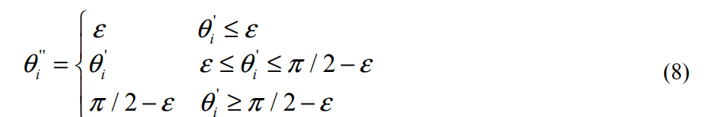
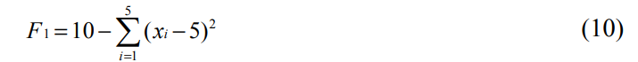
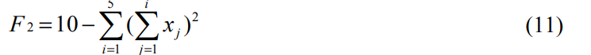
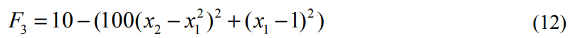
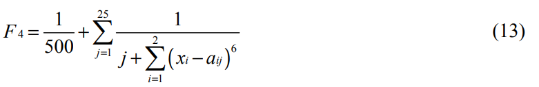
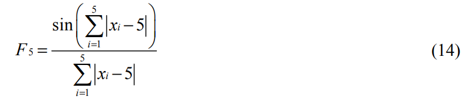
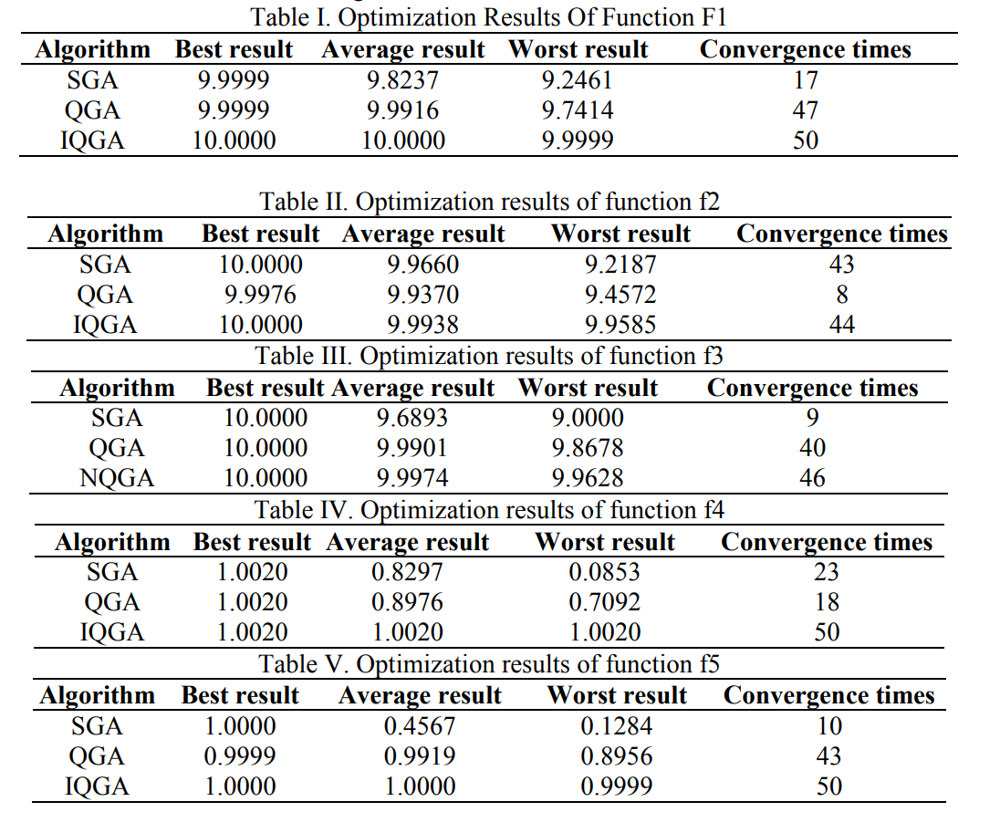
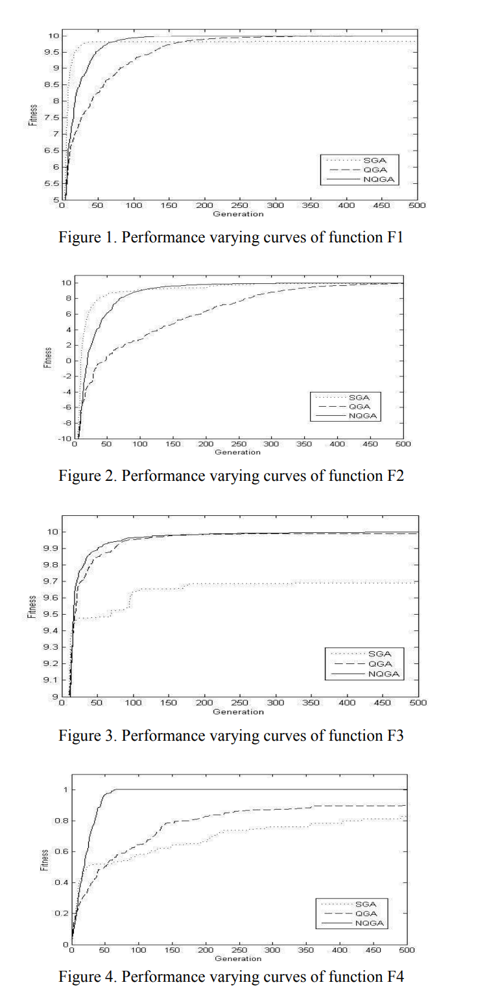
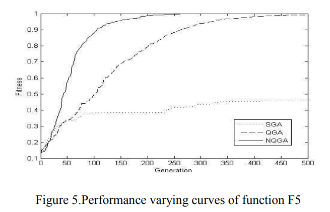

# A Novel Quantum Genetic Algorithm for Continuous Function Optimization 

## 要旨(Abstruct)
本論文では、新しい量子遺伝的アルゴリズムを提案する。このアルゴリズムは、量子染色体の確率期待値と最良の2進解を比較して回転ゲートの回転角を決定する。集団内の異なる個体が異なる速度で進化し、局所探索と大域探索を同時に実現する。Hεゲートはアルゴリズムの早期収束を防ぐために用いられる。本アルゴリズムとその大域的収束性を分析し、関数極値の最適化に適用し、単純遺伝的アルゴリズムおよび従来の量子遺伝的アルゴリズムと比較した。シミュレーション結果は、本アルゴリズムが高速な収束速度と高い解精度を持つことを示している。

## 1. 序論(Introduction)
量子遺伝的アルゴリズム（QGA）は、量子計算と遺伝的アルゴリズムに基づく知的最適化アルゴリズムである。2000年、Hanらは量子ビットと量子重ね合わせ特性に基づく遺伝的量子アルゴリズムを提案した。このアルゴリズムは量子状態ベクトルで遺伝コードを表現し、量子回転ゲートを用いて染色体の進化を実現する。これを0-1ナップサック問題に適用し、従来の遺伝的アルゴリズムと比較したところ、最適化性能が優れていることが確認された。しかし、多くの実験により、このアルゴリズムはナップサック問題にのみ適しており、連続最適化問題に適用すると早期収束が頻繁に発生することが分かっている。

本論文では、量子遺伝的アルゴリズムを詳細に分析したうえで、新しい量子遺伝的アルゴリズム（NQGA）を提案する。このアルゴリズムでは、量子ビットに対応する確率期待値と現在の最良の2進解を直接比較して回転角を決定する。早期収束を回避するために、Hεゲートを導入する。このアルゴリズムを関数極値の最適化に用い、単純遺伝的アルゴリズムおよび従来の量子遺伝的アルゴリズムと比較した結果、本アルゴリズムがより優れた性能を持つことを示す。

## QGA
QGAは、量子計算の概念と理論に基づく確率的最適化アルゴリズムの一種である。このアルゴリズムにおける最小の情報単位は量子ビット（qubit）である。qubitは状態0および1だけでなく、これら二つの状態の線形重ね合わせにもなり得る。qubitの状態は次のように表される：

  Ψ = α︱0〉 + β︱1〉  (1)

ここで、αおよびβは状態︱0〉および︱1〉の確率振幅であり、|α|²および|β|²が、それぞれqubitが︱0〉および︱1〉の状態で観測される確率を与える。

状態の正規化は以下の式によって保証される：

  |α|² + |β|² = 1  (2)

同時に、各量子ビットは位相平面における角度θで一意に示すこともできる：

  Ψ = cosθ︱0〉 + sinθ︱1〉  (3)

n個のqubitによって表される染色体は、2ⁿの基底状態の線形重ね合わせを確率的に表現することができる。量子回転ゲートを用いて染色体を更新することで、最終的に問題の最適解を得ることができる。

## NQGA
量子遺伝的アルゴリズムにおいて、回転ゲートはアルゴリズムの性能を決定する鍵である。従来のアルゴリズムでは、量子染色体を観測して得られた2進解と最良解を比較して回転角を決定していたが、この2進解の取得過程にはランダム性があり、進化の逆行が不可避となる。

量子染色体が測定されるとき、状態0が得られる確率はα²、状態1が得られる確率はβ²であるため、量子ビットの確率期待値は以下のようになる：

0 × |α|² + 1 × |β|² = |β|²　　　　　　　　(4)

したがって、量子ビットに対応する確率期待値を最良の2進解と比較して回転角を決定することで、最良解の選択確率を増加させることができる。

この染色体と回転ゲートは角度を用いて表現される。量子ビットの確率期待値は角度形式で以下のように表される：

0 × cos²θ + 1 × sin²θ = sin²θ　　　　　　　　(5)

回転ゲートは以下の式により決定される：

Δθᵢ = (bᵢ − sin²θᵢ) × 2r　　　　　　　　(6)

ここで、bᵢは最良の2進解のi番目のビットであり、最良2進解は最適保持機構から得られ、大域的収束性を保証する。θᵢは量子染色体のi番目のビットに対応する角度であり、rは回転角の調整係数である。rは以下のように定義される：

r = (k / Popsize + h) × l　　　　　　　　(7)

ここで、kは個体の番号、Popsizeは個体群のサイズ、hとlは定数である。hは個体群が大きすぎることでrが小さくなりすぎるのを防ぎ、結果として回転角が小さくなり進化速度が遅くなることを防ぐ。lを調整することで収束速度を制御できる。h = 0.01, l = 0.01πと設定する。rは個体によって異なるため、各個体は異なる速度で最良解に向かって進化する。

一方では、全ての量子染色体が同じ初期状態（すなわち全ての量子ビットのαとβが1/√2で、対応する角度がπ/4）から同じ速度で同じ目標に進化することを避けることができ、量子染色体間の多様性を維持できる。もう一方では、一部の個体が高速に最良解へ収束し微小空間で探索を行い、他の個体はゆっくりと収束し大域的な探索を続けることができる。

早期収束を回避するために、[5]を参考にしてHεゲートの概念を導入する。量子ビットの角度が進化全体を通して第1象限内にあることを前提に、以下のように定義される：

ここで、0 < ε << π/2 である。θ'ᵢは回転後の量子ビットの角度である。このHεゲートにより、角度は常に [ε, π/2 − ε] の範囲内に維持される。ε → 0 のとき、Hεゲートは通常の量子回転ゲートと一致し、ε → π/4 のとき、ゲートは機能しなくなる。

現在、量子遺伝的アルゴリズムを用いて連続最適化問題を解く過程では、量子染色体の崩壊によって得られた2進解を実数解に変換し、さらに適応度を計算するという手順が用いられている。しかし、この2進解を実数解に変換する過程にはハミングの崖（Hamming cliff）という問題が存在する。量子遺伝的アルゴリズムは本質的に、解空間上の確率分布に基づく最適化アルゴリズムであるため、この問題は特に深刻である。

具体的には、2つの実数解があり、それらの適応度関数の値が非常に近いにもかかわらず、それらに対応する2進解および、それらを生成する量子染色体は大きく異なり、結果として量子染色体が解空間の生成確率を正確に表せなくなる。一方で、グレイコードはこの問題をうまく解決できるため、本手法ではグレイコードを採用する。

改良されたアルゴリズムにおける主な手順は以下の通りである：

①
t = 1 とする。m 個の初期個体を生成し、個体群 Q(t) = {Θ₁ᵗ, Θ₂ᵗ, ..., Θₘᵗ} を構成する。ここで Θⱼᵗ は t 世代目における j 番目の個体であり、Θⱼᵗ = [θ₁ᵗ, θ₂ᵗ, ..., θₙᵗ] であり、n は各染色体に含まれる量子ビットの数である。すべての量子ビットにおける α および β を 1/√2 に設定し、対応する角度 θ を π/4 とする。これは、1つの量子ビット個体 Θⱼᵗ がすべての可能な状態の線形重ね合わせを等確率で表すことを意味する。

②
各 Θⱼᵗ を測定して pⱼᵗ を生成し、個体群 P(t) を構成する。

③
P(t) 内の各個体を評価し、最良解と比較して新たな最良解を得る。終了条件が満たされていればアルゴリズムを終了する。

④
t = t + 1 とする。

⑤
Q(t−1) を更新して Q′(t−1) を生成する。

⑥
手順 2 に戻る。

## Analysis of Nqga and Its Convergence

アルゴリズムの解析
本アルゴリズムの進化過程において、各量子ビットの角度は以下の式に従って生成される：

θᵢ′ = θᵢ + Δθᵢ = θᵢ + (bᵢ − sin²θᵢ) × 2r　　　　　　(9)

ここで、操作前の角度 θᵢ が第1象限内、すなわち 0 < θᵢ < π/2 にあると仮定する。r ∈ (0,1) であることを考慮し、最良2進解のビット bᵢ = 1 のとき：

Δθᵢ = 2(1 − sin²θᵢ) × r > 0

θᵢ′ = θᵢ + Δθᵢ = θᵢ + 2(1 − sin²θᵢ) × r

これは、角度が反時計回りに π/2 方向へ回転することを意味し、量子ビットが 1 になる確率を増加させる。しかし、回転後の角度は依然として π/2 未満であり、第1象限にとどまる。

一方、bᵢ = 0 のとき：

Δθᵢ = −2 sin²θᵢ × r < 0

θᵢ′ = θᵢ + Δθᵢ = θᵢ − 2 sin²θᵢ × r

これは、角度が時計回りに0方向へ回転することを意味し、量子ビットが 0 になる確率を増加させる。回転後の角度は0より大きく、第1象限内にある。

アルゴリズムの初期段階では、すべての量子ビットの角度が π/4 に初期化されているため、第1象限に属する。アルゴリズムが進化するにつれて、各量子ビットの角度は常に第1象限に制限され、最良解の方向へ進化していく。最終的に、すべての量子ビットの角度は、対応するビットが0であれば角度0、1であれば角度π/2へと収束し、個体群全体が最良解に収束する。

アルゴリズムにおいて、回転角 Δθᵢ は量子ビットの期待値と最良2進ビットとの差に比例する。この差が大きいほど、量子ビットが最良ビットに崩壊する確率は小さく、回転角は大きくなるため、最良解の生成確率が急速に増加する。一方、差が小さい場合は、量子ビットがすでに最良ビットに崩壊しやすく、回転角は小さくなるため、収束速度は緩やかになり、大域探索性能が保たれる。

Hεゲートの存在により、回転角の最小振幅は0まで小さくなり、角度は ε または π/2 − ε に収束する。

## Analysis of the convergence.(収束性の解析)
文献 [6,7] において、QGA の収束性については分析されているが、それはいずれも量子染色体に基づいたものである。量子遺伝的アルゴリズムの目的が最適解の獲得であり、量子染色体を測定して得られる2進解こそが我々の求める直接的な表現であることを考えると、量子染色体は解空間における確率分布を表す進化補助的なツールに過ぎない。

したがって、本稿では2進解に焦点を当てた収束性の解析を行う。さらに、最良の2進解が得られれば、それを用いて個体群内のすべての量子染色体は有限回の繰り返しで最良解に収束する。以下では、NQGA において2進解が大域的に収束することを証明する。

文献 [8,9] において、最適保持を行う遺伝的アルゴリズムは大域収束性を持つアルゴリズムであることが示されている。この理論に基づいて、NQGA の収束性を本稿で証明する。

Φ を長さ n のすべての2進列からなる集合とし、その全要素は2進解空間全体を構成する。サイズ N の2進個体群は、状態空間 S = Φ^N における1つの点とみなすことができ、その生成確率は量子染色体個体群が表す確率分布に依存する。これは、前回の繰り返しにおける生成確率と最良の2進解にのみ関連し、それ以前のすべての状態とは無関係である。したがって、個体群の進化は有限のマルコフ連鎖とみなすことができる。

t回目の繰り返しで、個体群内の i 番目の量子染色体が
Θᵢᵗ = [θ₁ᵗ, θ₂ᵗ, ..., θₙᵗ]
であるとする。この量子染色体を測定すると、2進解
Bᵢᵗ = [b₁ᵗ, b₂ᵗ, ..., bₙᵗ]
が得られる。Hε ゲートの作用を受けた後、次世代 (t+1) における量子染色体は
Θᵢᵗ⁺¹ = [θ₁ᵗ⁺¹, θ₂ᵗ⁺¹, ..., θₙᵗ⁺¹]
となり、それを測定することで
Bᵢᵗ⁺¹ = [b₁ᵗ⁺¹, b₂ᵗ⁺¹, ..., bₙᵗ⁺¹]
が得られる。

t回目の繰り返しにおける j番目のビット bⱼᵗ がどのような値であっても、t+1回目の繰り返しにおいてそのビットが0または1になる確率 pₜ₊₁ は 2sin²ε ≥ pₜ₊₁ > 0 を満たす。したがって、進化過程において、個体群が任意の状態 sᵢ から別の状態 sⱼ へと遷移する確率は
pᵢⱼ ≥ (2sin²ε)ⁿⁿ > 0
を満たす。これは遷移確率行列が厳密に正であることを意味する。

文献 [8,9] によれば、遺伝的アルゴリズムが以下の条件を満たすとき、大域最適解に有限世代で収束する：

最良解が保持されること

状態遷移確率行列が厳密に正であること

本稿で提案するアルゴリズムは最良解保持機構を採用しているため、大域的に収束することが保証される。

## Experiment

その性能を検証するために、NQGA を関数の極値最適化に使用し、単純遺伝的アルゴリズム（SGA）および量子遺伝的アルゴリズム（QGA）と比較を行った。以下の5つの関数が使用された。

### 1. Sphere関数

　F₁(x) = 10−∑(xᵢ − 5)²（i = 1 〜 5）
　範囲：1 ≤ xᵢ ≤ 10
　グローバル最大値の位置：xᵢ = 5
　最大値：10
　最適化結果が9.99を超えた場合、収束と見なす。

### 2. Schwefelの問題1.2

　F₂(x) = 10−∑(∑xⱼ)²（i = 1 〜 5, j = 1 〜 i）
　範囲：|xᵢ| ≤ 10
　最大値の位置：xᵢ = 0
　最大値：10
　最適化結果が9.99を超えた場合、収束と見なす。

### 3. Rosenbrock function 

　F₃(x) = −[100(x₂ − x₁²)² + (x₁ − 1)²]
　範囲：|xᵢ| ≤ 5.12
　最大値の位置：xᵢ = 1
　最大値：10
　最適化結果が9.99を超えた場合、収束と見なす。

### 4. Shekelのキツネ穴関数（foxholes function）

　範囲：|xᵢ| ≤ 65.536
　最大値の位置：xᵢ = −32
　最大値：1.002
　最適化結果が1を超えた場合、収束と見なす。

### 5. Sinc関数

　範囲：1 ≤ xᵢ ≤ 10
　最大値の位置：xᵢ = 5
　最大値：1
　最適化結果が0.99を超えた場合、収束と見なす。

これら5つの関数に対して、NQGA、QGA、SGAの各アルゴリズムを50回ずつ最適化に用いた。いずれのアルゴリズムも、個体群サイズは30、最大繰り返し数は500、突然変異確率Pmは0.01とし、SGAにおける交叉確率Pcは0.8に設定した。最適化結果は以下の表と図に示す。

それぞれの関数に対する性能変化を示す図（Figure 1〜5）では、NQGA が他の2つのアルゴリズムと比較して一貫して速い収束速度と高い精度を持っていることが示されている。

## 結論
量子遺伝的アルゴリズムに存在する欠点を分析したうえで、本稿では新しい量子遺伝的アルゴリズム（NQGA）を提案した。アルゴリズムとその収束性について解析を行い、関数の極値最適化問題に本手法を適用した。

シミュレーション結果から、本アルゴリズムは単純遺伝的アルゴリズム（SGA）および従来の量子遺伝的アルゴリズム（QGA）と比較して、収束速度および解の精度の両面で優れていることが示された。
