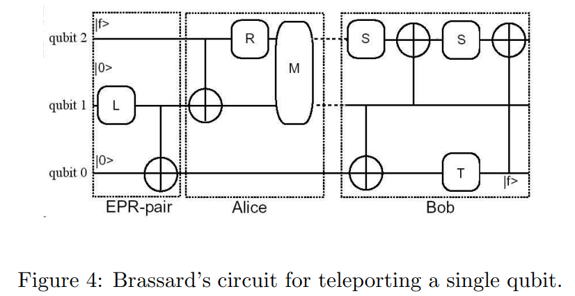

# Genetic Algorithms and Quantum Computation

## 要旨(Abstruct)
近年、研究者たちは遺伝的アルゴリズム（GA）を量子計算のいくつかの問題に適用してきた。また、量子理論の概念と技術に基づく遺伝的アルゴリズムの設計に関する研究も存在する。いわゆる量子進化的プログラミング（Quantum Evolutionary Programming）は大きく2つの分野に分けられる：量子インスパイア型遺伝的アルゴリズム（QIGA）と量子遺伝的アルゴリズム（QGA）である。前者は量子ビット（qubit）染色体を表現として採用し、最適解探索のために量子ゲートを利用する。後者は、この分野における主要な問い――すなわち、遺伝的アルゴリズムが量子ハードウェア上で実装されたとき、どのような形になるか――に取り組むものである。後述するように、この問いに対する完全な答えはまだ得られていない。QGAにおける重要な課題は、GAと量子計算の並列性、ならびに量子コンピュータによって提供される真の乱数性の両方を活かす量子アルゴリズムを構築することである。

本論文の前半では、我々自身の研究も含め、GAと量子計算に関する主要な研究成果を概観する。次に、量子計算およびGAの基本概念を再確認し、それらに内在する並列性に焦点を当てる。その後、量子演算子の学習および量子回路設計へのGAの応用について述べる。続いて、量子進化的プログラミングの分野を検討し、最後に我々の現在の研究と今後の展望を示す。

キーワード：遺伝的アルゴリズム、量子計算、進化戦略


## 1. 序論(Introduction)
本論文の目的は二つある。第一に、量子計算への遺伝的アルゴリズム（GA）の応用および量子進化プログラミングの分野における主要な研究を概観すること。第二に、このレビューに基づいて我々の現在の研究の一環として新たな展望を提示することである。

過去20年間で、従来の計算科学の枠組みでは困難とされる問題に効率的に取り組める可能性があることから、量子計算と量子情報への関心が高まっている。量子計算と量子情報は、量子状態に保存されたデータの処理と伝送を含んでおり（[20]参照）、これらの分野では、計算は物理系の進化によって行われ、その進化は量子力学の法則に従うユニタリ演算子によって制御される。

基本的な情報単位は量子ビット（qubit）であり、これは古典的な0と1のビットに対応する概念である。量子計算と量子情報は、量子並列性、状態の重ね合わせ、量子もつれ（エンタングルメント）などの量子効果を活用することで、古典的手法よりも効率的な計算理論を実現しようとする。これは、量子因数分解やGroverのデータベース探索アルゴリズムなどを通じて実証されてきた [14]。

一方、遺伝的アルゴリズム（GAs）は現在急速に拡大している研究分野である。これは1960年代にJohn Hollandによって発明されたものである [13]。簡単に言えば、GAsは自然選択と自然遺伝のメカニズムに基づいた確率的探索アルゴリズムである [9, 16, 15]。この手法は、主に非線形かつ巨大な探索空間において、従来の方法では効率的な探索が困難であるような問題に対して、有望な解を見つける能力が注目され、さまざまな分野の研究者の関心を集めている。

このような背景の中で、量子計算に対するGAの応用や、量子理論に基づいた進化的プログラミングの研究が現れてきた。これらの研究はまだ少数ではあるが、進化計算の分野において非常に魅力的なテーマである。

GAsを応用する際、人々はしばしば「通常とは異なる空間における解の探索能力」に惹かれる。そのため、量子演算子の学習 [6, 8] や量子回路の設計 [31, 29, 23] にGAsを適用する試みが行われてきた。

これらの研究は、量子計算の基本的な結果、すなわち「すべての計算はユニバーサルゲートで構成される回路へと展開可能である」という事実に基づいている。これらのゲートは、系を所望の計算に導くユニタリ演算子Uの展開を提供する。

したがって、自然に以下の2種類の問題が生じる：
(1) 関数点の集合 $S = {(x, y)}$ が与えられたとき、$y = U·x$ を満たす演算子Uを求める問題。
(2) ある問題が与えられたとき、それを解決する量子回路を求める問題。

前者は量子演算子の学習という文脈で提起されており [6, 8]、後者は進化的戦略によって扱われている [31, 29, 23]。

[6]では、線形演算子の学習に基づくGA手法を提案した。この手法は量子（ユニタリ）演算子の学習に適用され、Dan Venturaによる従来の手法 [28] の限界を克服できることが示された。この従来の手法は、基本的なニューラルネットワークに類似している。

後者の問題群に関しては、Spectorによって3つのスキームが提案されており、それは伝統的なツリー型GP（遺伝的プログラミング）[15]、スタックレスおよびスタックベースの線形ゲノムである。また、WilliamsとGrayの別のスキームでは、既知の量子回路のユニタリ行列を用いて、代替となる可能性のある回路を探索している [29]。

我々の現在の研究に近いものとしては、Rubinstein [23] およびYabuki [31] の研究がある。これらの研究では、もつれ状態の生成および量子テレポーテーションが対象問題であった。


## 2. 量子計算とGAの基礎
### 2.1 量子計算

実際上、量子計算において最も実用的なモデルは量子回路モデルである [19, 21]。このモデルにおける基本的な情報単位は量子ビット（qubit）であり、これは2つの独立した状態$|0⟩$および $|1⟩$の重ね合わせとして記述され、次のように表される：

$$
    |ψ⟩ = α₀|0⟩ + α₁|1⟩
$$

ここで、$α₀, α₁$ は複素数であり、$|α₀|² + |α₁|² = 1$ を満たす。これらの係数はそれぞれの状態の確率振幅として解釈される。

$n$個の量子ビットからなる合成系は、各量子ビットに対応するヒルベルト空間のテンソル積によって構成される$N = 2ⁿ$個の独立状態によって記述される。この物理的実現は量子レジスタと呼ばれる。自然基底は次のように表される：

$$
    { |i₀i₁...iₙ₋₁⟩ ; iⱼ ∈ \{0,1\}, j = 0,1,...,n−1 }
$$

この集合は $|i⟩$（$i = 0$ から $N−1$）として添字付きで表される。

量子力学の公理に従えば、任意の時刻$t$における状態$|ψ⟩$は以下のように基底状態の重ね合わせとして展開される：

$$
\begin{align}
    |\psi⟩ = \sum_{i=0}^{N−1} \alpha_{i}|i⟩ ; \; \sum_{i=0}^{N−1} |\alpha_{i}|^2 = 1
\end{align}
$$

量子計算におけるもう一つの重要な概念は量子もつれ（エンタングルメント）であり、これは古典的な対応物を持たない。

例として、2つのqubitからなる合成系を考える。このとき、系は $H₁ ⊗ H₂$のヒルベルト空間に属し、次のように表される：

$$
    |ψ⟩ = |ψ₁⟩ ⊗ |ψ₂⟩ = \sum_{i,j ∈ \{0,1\}} a₁ᵢ a₂ⱼ |i⟩₁ ⊗ |j⟩₂
$$

しかし、&H₁ ⊗ H₂& に属するすべての状態がこのようなテンソル積で表せるわけではない。そのような状態はもつれ状態と呼ばれる。有名な例としてベル状態（EPRペア）がある：

$$
    |β₀₀⟩ = \frac{1}{\sqrt{2}}(|0⟩₁⊗|0⟩₂ + |1⟩₁⊗|1⟩₂)
$$


この状態をテンソル積 $|ψ₁⟩⊗|ψ₂⟩$ の形に変形しようとすると矛盾する線形方程式系が生じるため、不可能である。

このようなもつれ状態は、量子テレポーテーションなどのプロトコルにとって本質的な要素である [7, 19]。

量子回路モデルにおける計算ユニットは、初期状態を発展させるユニタリ演算子としての量子ゲートである。量子アルゴリズムは次の3つのステップに要約できる：

初期状態の準備

ユニバーサルな量子ゲートの列による進化

量子測定

量子力学の理論によれば、最終段階の測定によって状態は「崩壊」し、我々が事前に知り得るのは測定結果に関する確率分布だけである。

量子測定は、$\{Mₘ\}$ という演算子集合（$∑ Mₘ†Mₘ = I$）によって記述される。状態 $|ψ⟩$ に対し、測定結果$m$が得られる確率は：

$$
    p(m) = ⟨ψ|Mₘ†Mₘ|ψ⟩
$$

測定後の状態は：
$$
    \ket{\psi}_{after} = \frac{M_m \ket{\psi}}{\sqrt{\bra{\psi}M_m^{\dagger}M_m \ket{\psi}}}
$$

特に、計算基底での測定は $\{|i⟩⟨i|\}$ によって定義され、測定結果&m&の確率は $|αₘ|²$、測定後の状態は $(αₘ/|αₘ|)·|m⟩$ である。

次に、**量子並列性（quantum parallelism）**という量子計算の特徴を示すためにHadamard演算子$H$を考える：

$$
    H|0⟩ = \frac{|0⟩ + |1⟩}{\sqrt{2}}, H|1⟩ = \frac{|0⟩ - |1⟩}{\sqrt{2}}
$$

これを用いて、関数 $f: \{0,1\}→\{0,1\}$ に対応する量子演算子$U_f$を定義する：
$$
    U_f |x⟩⊗|y⟩ = |x⟩⊗|y ⊕ f(x)⟩
$$

記号$\oplus$は、mod 2での加法を意味するとする。

状態 $|ψ⟩ = |0⟩⊗|0⟩$ に対して $(I⊗H)$ を適用し、その後に $U_f$ を適用すると：

$$
    U_f (I⊗H) |0⟩⊗|0⟩ = |0⟩⊗ (\frac{|f(0)⟩ + |f(1)⟩}{\sqrt{2}})
$$

これは、$f(0)$ と $f(1)$ の情報を同時に含んでいるように見える。これが量子並列性の例であり、多ビット関数に一般化可能である。

テンソル積記号 $|i⟩⊗|j⟩$ は以降、簡略に $|ij⟩$ または $|i⟩|j⟩$ と表記する。

量子計算における基本的な結果として、任意の$d$次元ヒルベルト空間上のユニタリ行列$U$は、低次部分空間上で非自明な動作をする有限個のユニバーサルゲートで構成可能であることが知られている。Hadamardゲート（$H$）はその1つである。

もう1つの代表的なゲートがCNOTゲートである。定義は以下の通り：

$$
    CNOT|00⟩=|00⟩, CNOT|01⟩=|01⟩ \\
    CNOT|10⟩=|11⟩, CNOT|11⟩=|10⟩
$$

つまり、制御ビットが0のときはターゲットビットを変化させず、1のときは反転させる。

これらのゲートの行列表示は：

$$
CNOT =
\begin{bmatrix}
    1 & 0 & 0 & 0 \\
    0 & 1 & 0 & 0 \\
    0 & 0 & 0 & 1 \\
    0 & 0 & 1 & 0
\end{bmatrix}
$$

$$
H = \frac{1}{\sqrt{2}}
\begin{bmatrix}
    1 & 1 \\
    1 & -1
\end{bmatrix}
$$


### 2.2 進化計算とGAs
1950年代から1960年代にかけて、複数の計算機科学者が独立して「進化的なシステム」に関する研究を行った。それは、生物進化の仕組みをエンジニアリング問題の最適化手法として用いることができるというアイデアに基づいていた。これらのシステムに共通する考え方は、自然選択と自然遺伝のメカニズムに着想を得て、ある問題に対する候補解の集団を進化させるというものであった。

このアイデアから派生して、進化戦略（evolution strategies）、進化的プログラミング（evolutionary programming）、遺伝的アルゴリズム（genetic algorithms）の3つの主要分野が発展した。現在では、これらが進化計算（evolutionary computation）分野の中核をなしている [16, 1]。

遺伝的アルゴリズム（GAs）は1960年代にJohn Hollandによって発明された [13]。Hollandの最初の目的は、自然界において適応が生じる現象を形式的に研究し、自然の適応メカニズムを計算機システムに取り入れる方法を開発することであった。Hollandの研究では、GAは生物進化の抽象モデルとして提示され、適応の理論的枠組みが与えられている。Holland型GAは、自然選択と交叉・突然変異といった遺伝的操作を用いて、ある染色体集団から次の集団へと移行する方法である。

各染色体は遺伝子（ビット列）で構成され、各遺伝子は特定のアリル（0または1）のインスタンスである。

伝統的に、これらの交叉および突然変異は以下のように実装される [13, 16]：

交叉（Crossover）：2つの親染色体を用いて2つの子染色体を生成する。両親染色体は共通の交叉点で左右に分割され、それぞれの子染色体は片方の親の左部分ともう片方の親の右部分を受け継ぐ。
例：親染色体が 01110010 と 10011110、交叉点がビット3と4の間である場合、子染色体は 01111110 と 10010010 となる。

突然変異（Mutation）：染色体を選び、ランダムにいくつかの遺伝子を変更する。該当するビットは 0→1 または 1→0 に反転される。

これらの操作は、GAが本質的に並列的なアルゴリズムであることを示している。GAsは、適応度の高い染色体（解）を発見・強調し、それらの「良い構成要素（ビルディングブロック）」を再結合することによって動作する。そして、これらの操作は並列的に実行しやすい。GA文献ではこの点が数多く指摘されている [3, 12]。

次に、アリルが実数値である場合、すなわち0-1表現を一般化した実数値GAについて述べる。このタイプは実数値遺伝的最適化アルゴリズム（real-coded genetic optimization algorithms）に分類され、セクション3.1で使用される。

遺伝的最適化アルゴリズムは、専門知識を組み込みにくい、あるいは従来の最適化手法では十分に扱えないような、大規模で非線形な空間の探索に用いられる確率的探索アルゴリズムである [9]。

標準的なGAを設計するには、以下の要素が必要である：

(1)初期集団を選定する方法

(2)目的関数を非負の適応度関数に変換するスケーリング関数

(3)各個体に対して子孫の期待数（ターゲットサンプリング率）を計算する選択関数

(4)このターゲットサンプリング率を使って繁殖させる個体を選ぶサンプリングアルゴリズム

(5)親個体から新しい個体を生成する再生演算子

(6)再生演算子をどの順番で適用するかを決定する方法

たとえば [30] では、各個体（染色体）は実数ベクトル $x = (x₁, x₂, ..., xₘ) ∈ ℝᵐ$ として表され、各成分 $xᵢ$ が遺伝子、すなわちアリルとなる。したがってアリルは実数値を取る。これに応じて、遺伝的操作の定義に注意が必要となる。

突然変異は染色体に摂動を加えることによって実装される。[30] では、摂動を $ℝᵐ$ 全体に加えるのではなく、座標軸方向のみに限定することで、スキーマ定理との整合性を保ちながら実装されている（スキーマ定理はGAにおける基本的結果である [13, 9]）。

一方、$ℝᵐ$ における交叉にも課題がある。図1ではその困難さを説明している。楕円は目的関数の等高線であり、中心が局所最小である。点 $(x₁,y₁)$ および $(x₂,y₂)$ はいずれも比較的良好な点であるが、従来型の交叉（セクション2.2で説明）を適用すると、それらの子が親よりも悪い点に位置する可能性がある。

この問題を回避するために、[30] では**線形交叉（linear crossover）**という再生演算子が提案されている。2つの親 $p₁, p₂$ から、以下の3点が生成され、そのうち最良の2点が選ばれる：

$(p₁ + p₂)/2$

$(3/2)p₁ − (1/2)p₂$

$(−1/2)p₁ + (3/2)p₂$

この分析に基づいて、セクション3.1では線形演算子を学習するためのアルゴリズムを提案している。


## 3. 量子計算へのGAの応用
### 3.1. 演算子学習のためのGA
演算子 $F: V → V$ を直接知らないと仮定し、代わりに次のような関数点の集合が与えられているとする：

$S = { (|χᵢ⟩, |ψᵢ⟩) ; F|χᵢ⟩ = |ψᵢ⟩, i = 0,1,...,n−1 }$

ここで $\dim(V) = n$ であり、この集合は学習列（learning sequence）とも呼ばれる。このとき、$G$という関数を仮定し、$G|χᵢ⟩ ≈ |ψᵢ⟩$（つまりノルムの差が非常に小さい）となるようにしたい（通常、ノルムは内積から導かれる $‖|v⟩‖ = \sqrt{⟨v|v⟩}$ とする）。

この節では、関数$G$を見つけるための、GAに基づいた一般的な学習アルゴリズムを提示する [6]。

この研究の動機は、Dan Ventura による量子演算子学習アルゴリズム [28] にあり、これはニューラルネットワークに基づく基本的な手法に類似している。我々のGA法は、Venturaの手法よりも幅広い応用が可能である。これが本研究の主な貢献である。

[30] に従い、各個体（染色体）は実数値行列 $A \in \mathfrak{R}^{n \times n}$ で表され、アリル（遺伝子）は行列の要素（実数）である。アリルの値域は $[−1, 1]$ に制限されているが、より一般的な設定も可能である。

初期集団はランダムに生成される。一度集団が得られたら、各個体に対して適応度が計算される。適応度関数は以下で定義される：

$$
    fitness(A) = \exp(−error(A)); A \in \mathfrak{R}
$$

誤差関数 $error(A)$ は以下の通り：

$$
    error(A) = \frac{1}{n \cdot m} \sum_{i=1}^{m} ||A\ket{\chi_{i}} - \ket{\psi}_{i}||_{1}
$$
$
ここで、$‖x‖₁$ は1-ノルム、すなわちベクトル成分の絶対値の和である。

すべての個体に対して適応度を計算し、それに基づいて昇順にソートする。次にGAのループに入る。ループの前に以下のパラメータを定める：

- 集団サイズ（$N$）：各世代の個体数

- エリート数（$Ne$）：各世代で保持する最良個体の数。Kenneth De Jong によって導入された手法であり、GA性能向上に寄与する [16]。

- 選択圧（$Ps$）：高適応度個体が多く子孫を残す度合い。例えば $Ps = 0.6$ で $N$ 個体なら、上位 $0.6·N$ 個体だけが交叉・突然変異に使われる。

- 突然変異数（$Nm$）：突然変異を受ける最大アリル数。ここでは行列要素をランダムに選び、摂動を加える。

- 最大世代数（$Ngen$）：GAを繰り返す最大回数。

- 交叉・突然変異確率（$Pc, Pm$）：各操作が行われる確率。

- 交叉操作は以下のように定義される。2つの親 $A = [aᵢⱼ], B = [bᵢⱼ]$ から2つの子 $C₁, C₂$ を生成する：

親のいずれかをランダムに選ぶ

各成分 $(i,j)$ に対して、選ばれた親の値を $cᵢⱼ$ に代入する

突然変異はアリルの摂動として実装される。つまり、$A → A + Δ$ とし、$Δ$ は摂動行列。非ゼロの$Δ$成分の数は$Nm$で制御し、各成分は指定範囲$[a,b]$内の値に設定される。

以下はアルゴリズムの疑似コードである（$P(t)$ は時刻$t$の集団、Evaluate Sortは適応度計算とソートを行う）：

Procedure Learning-GA
  t ← 0;
  initialize P(t);
  while (t < Ngen) do
    t ← t + 1;
    Evaluate Sort(P(t−1));
    Store in P(t) the Ne best members of P(t−1);
    Complete P(t) by crossover and mutation;
  end while


### 3.1.1 実験結果
まず、[28] で提示された例と同じ問題に対して本GA学習アルゴリズムの挙動を分析する。

与えられる関数点集合 S は以下の通り：

$$
S =
\left\{
\begin{aligned}
&\frac{1}{\sqrt{5}} \begin{bmatrix} 2 \\ 1 \end{bmatrix}, \quad
\frac{1}{\sqrt{10}} \begin{bmatrix} 3 \\ 1 \end{bmatrix}, \\
&\frac{1}{\sqrt{20}} \begin{bmatrix} -2 \\ 4 \end{bmatrix}, \quad
\frac{1}{\sqrt{40}} \begin{bmatrix} 2 \\ -6 \end{bmatrix}
\end{aligned}
\right\}
$$

ここで、ターゲットとなる演算子は Hadamard変換$H$ である（式(8)で定義されたもの）。

25回の実行において、GAは常に正しい結果を得た。使用されたパラメータは表1の1行目に記載されている。摂動サイズは [0.001, 0.1] に設定された。

| Matrix | Ngen | N   | Pc   | Pm   | Ps   | Ne | Nm |
|--------|------|-----|------|------|------|----|----|
| 2 × 2  | 100  | 200 | 0.85 | 0.95 | 0.30 | 30 | 1  |
| 2 × 2  | 200  | 200 | 0.85 | 0.95 | 0.30 | 30 | 1  |
表1：本節の例で使用されたパラメータ（定義は3.1節参照）

図2は25回の実行における誤差の推移を示している。各世代における最良個体（誤差最小）の平均値をプロットしている。アルゴリズムは比較的早期に解に近づくが、完全な収束には時間がかかる傾向がある。この挙動は [8] で報告されたすべての実験に共通して観察された。

図2：式(15)による例に対する$25$回実行時の誤差の推移

なお、Dan Venturaのアルゴリズムもこの例に対して正しい結果を与えることが[28]で報告されている。

次に、以下の関数点集合 S を考える：

$$
S =
\left\{
\begin{aligned}
&\frac{1}{\sqrt{5}} \begin{bmatrix} 1 \\ 2 \end{bmatrix}, \quad
\frac{1}{\sqrt{10}} \begin{bmatrix} 3 \\ -1 \end{bmatrix}, \\
&\frac{1}{\sqrt{2}} \begin{bmatrix} 1 \\ 1 \end{bmatrix}, \quad
\frac{1}{\sqrt{4}} \begin{bmatrix} 2 \\ 0 \end{bmatrix}
\end{aligned}
\right\}.
$$

この集合では入力ベクトルが直交正規基底になっていない。したがって、[6] で示したように、Venturaのアルゴリズムを適用するとターゲットから大きく外れた結果になる（詳細は[8]参照）。しかし、我々のGAアルゴリズムはこのケースにも対処可能であった。ターゲット演算子は先と同様、Hadamard変換である。

表1の2行目がこのケースで使用されたパラメータである。すべてのパラメータを前の例と同じにしたかったが、正しい結果を得るには世代数（Ngen）を増やす必要があった。このことは、入力ベクトル集合 ${ |χ₀⟩, |χ₁⟩ }$ が直交正規系でない場合でも学習可能ではあるが、収束にはやや敏感である可能性を示唆している。追加の例でこの傾向を確認する必要がある。

誤差の平均推移は最初の例と同様の挙動を示す。初期には急激に減少するが、最終的にゼロになるまでには時間がかかる。

この2つの実験において、交叉確率・突然変異確率（$Pc, Pm$）は同一で済んでいる（詳細は[8]参照）。これは、パラメータの安定性を示す可能性がある。また、1回の実行にかかる時間は非常に短く（≤ $0.04$秒）、実用的である。


### 3.2. 量子回路設計のためのGA
量子計算は科学的および技術的に重要であるにもかかわらず、古典的アルゴリズムよりも高速な量子アルゴリズムはごくわずかしか発見されていない。代表的な例としては、Shorの因数分解アルゴリズム、Groverの探索アルゴリズム、Deutsch-Jozsaアルゴリズムがある [14, 19]。

これは、人間の研究者にとってそのようなアルゴリズムや回路を生成するのが困難であるためである。量子力学の特徴、例えばもつれや測定による状態の崩壊などが、直感的な理解を妨げる。そのため、遺伝的プログラミングや遺伝的アルゴリズムといった確率的探索手法をこの課題に用いる試みがなされている。

この分野の主要な研究として [31, 23, 29, 27] があるが、我々の現在の研究に最も近いのは [31] および [23] の研究である。

<span style="color: #4169e1; ">
[23] では、量子回路を進化的に生成するための新しい表現方法と対応する遺伝的操作の集合が提案されている。量子回路は「ゲート構造（gate structure）」のリストとして表され、ゲート数（回路のサイズ）は事前に設定された最大数まで可変である。各ゲート構造には、ゲートの種類（例：Identity、CNOT、Hadamard、測定ゲート）およびそのゲートに対する量子ビットやパラメータのカテゴリに関するビット列が含まれている（図3参照）。
</span>

交叉および突然変異は以下のように定義されている。
<span style="color: #4169e1; ">
交叉は、個体構造のすべての階層（ゲート、量子ビット、パラメータ）に作用する。
</span>
2つの親回路から、それぞれランダムに1つのゲートを選び、その後のすべてのゲートを交換する。パラメータに関するビット列の交叉は同カテゴリ間でのみ行われ、固定長GAにおける交叉と同様に、交叉点を選び、その点以降を交換する。

突然変異はゲートレベルで行われる。
<span style="color: #4169e1; ">
具体的には、ゲートをランダムに新しいゲートで置き換える。
</span>
突然変異の確率は小さく設定されており（通常0.001）、これは「重要なビルディングブロックの損失を防ぐための保険」として扱われている。ただし、回路最適化を行う場合にはこの見解は見直される可能性がある。

目標状態と出力状態を比較するための誤差関数が定義されており、
$$
    error = \sum_{i,j} |σᵢⱼ − dᵢⱼ|
$$
と表される。ここで、$σᵢ$は各ケースにおける得られた状態、$dᵢ$は望ましい状態である。

> [!NOTE]
> $\sigma_{i}$, $d_{i}$の定義は？また、$d_{i}$を最初から知ることできる？？

[31] は、量子回路設計へのGA適用の別の提案である。基本方針は [23] と類似している。

[31] の事例研究は「量子テレポーテーション回路」である。量子テレポーテーションとは、量子状態を非局所的な相互作用を通じて遠方へ転送する技術である [4]。この回路はBennettら [4] によって物理的に提案され、Brassard [5] によって具体的な量子回路（図4）が与えられた。

図4の回路では、3つの量子ビット（qubit 0, 1, 2）があり、以下の量子ゲートを含む：L, R, S, T（それぞれ式(17)(18)で定義）、測定ゲートM、およびCNOTゲート（式(11)）である。

$$
L = \frac{1}{\sqrt{2}} \begin{bmatrix} 1 & -1 \\ 1 & 1 \end{bmatrix}, \quad
R = \frac{1}{\sqrt{2}} \begin{bmatrix} 1 & 1 \\ -1 & 1 \end{bmatrix}, \\
S = \begin{bmatrix} i & 0 \\ 0 & 1 \end{bmatrix}, \quad
T = \begin{bmatrix} -1 & 0 \\ 0 & -i \end{bmatrix},
$$



この回路では、まずもつれ状態（EPR状態、式(4)）を生成する。初期状態 $|f⟩⊗|0⟩⊗|0⟩$ に対して、$I⊗L⊗I$ を適用すると：

$$
I \otimes L \otimes I \, \ket{f} \ket{0} \ket{0}
= \ket{f} \left( \frac{1}{\sqrt{2}} \left( \ket{0} + \ket{1} \right) \right) \ket{0} 
= \ket{f} \left( \frac{1}{\sqrt{2}} \left( \ket{0} \ket{0} + \ket{1} \ket{0} \right) \right)

$$

次に、$CNOT₀₁$を適用すると：

$$
I \otimes \text{CNOT}_{01} \left( 
\ket{f}  \frac{ \ket{0} \ket{0} + \ket{1} \ket{0} }{ \sqrt{2} } \right)
= \ket{f} \frac{ \ket{0} \ket{0} + \ket{1} \ket{1} }{ \sqrt{2} }
\equiv \ket{f} \ket{\beta_{00}}
$$

ここで $|β₀₀⟩$ はベル状態である。

その後、Aliceが操作と測定を行い、Bobが操作を行うことで、qubit 2 にあった状態が qubit 0 に転送される（つまりテレポーテーションが行われる）。

> [!NOTE]
> この辺り良く分からない。。4章から読む。


符号化と評価関数

[23] のアプローチにおいて、回路はゲート列のリストとして構成されている。各ゲートには、使用する量子ビットの位置と、必要に応じてゲートのパラメータが割り当てられる。符号化方式により、量子回路は変動長の個体として表現される。

適応度評価は以下のように行われる。すなわち、ある入力状態に対して、得られた出力状態と目標出力状態との「距離」を定義し、それを最小化するようにGAが動作する。これは、行列のエントリごとの差の絶対値の総和、または状態ベクトルのノルムの差などで実装される。

また、[31] では目標とする量子回路（たとえばテレポーテーション）に対し、評価関数を構成するための一連のテスト入力と対応する出力が用意され、それに基づいて設計された回路の出力との一致度を計算する。

これらの評価基準により、GAは正確に目標機能を果たす量子回路構造を進化させることができる。


## 4. 量子進化的プログラミング（Quantum Evolutionary Programming）

### 4.1 Quantum-Inspired Genetic Algorithms
この節ではレビューの第2部、すなわち量子計算の概念に基づいた遺伝的アルゴリズムの分析を示す。これは、遺伝的アルゴリズムを量子ハードウェア上で実装するための重要なステップである。

まず、[11] で提案された量子インスパイアード遺伝的アルゴリズム（Quantum-Inspired Genetic Algorithm, QIGA）から始める。QIGAは、量子ビット（qubit）や確率振幅など、量子計算の原理を特徴とする。従来のバイナリ表現や数値表現、記号表現の代わりに、QIGAでは量子ビット表現を用いる [15, 16]。

より具体的には、QIGAでは以下のような m-量子ビット表現を用いる：

$$
\left[
\left( \begin{array}{c} \alpha_{10} \\ \alpha_{11} \end{array} \right),
\left( \begin{array}{c} \alpha_{20} \\ \alpha_{21} \end{array} \right),
\ldots,
\left( \begin{array}{c} \alpha_{m0} \\ \alpha_{m1} \end{array} \right)
\right]
$$

ここで、各ペア$(\alpha_{i0}, \alpha_{i1})$は、それぞれ1つの量子ビット（qubit）を表している。

ここで、量子ビット表現においてどのように収束が得られるかを説明する必要がある。
この点について、[11] で提案された以下のスキームを考える。

各$m$-量子ビット染色体（式(23)の形式）に対して、バイナリ列$\{x_1, x_2, \cdots, x_m\}$が定義される。このバイナリ列の各ビットは、それに対応する量子ビットの確率、すなわち$|\alpha_{i0}|^2$または$|\alpha_{i1}|^2$を用いて決定される。

ここで注目すべきなのは、もし$|\alpha_{i0}|^2$または$|\alpha_{i1}|^2$が$1$または$0$に近づくと、その量子ビット染色体は単一の状態へと収束し、状態の重ね合わせによって与えられていた多様性は徐々に失われていく、という点である。

> [!NOTE]
> おそらく、$\ket{\psi_i} = \alpha_{i0}\ket{0} + \alpha_{i1}\ket{1}$と想定している。

アプリケーション依存の適応度関数が用いられ、解$\{x_1, x_2, \cdots, x_m\}$を評価する。
次のステップは、効率的な進化戦略を設計することである。これは交叉や突然変異によって実現されるが、[11] ではそれらの実装については説明されていない。もちろん通常通り、親染色体間での一点交叉や、式 (23) における任意に選ばれた量子ビット$(\alpha_{i0}, \beta_{i1})$を変更するユニタリ演算子の適用を想定することはできる。

しかしながら、QIGA では量子ビット表現によって多様性がもたらされるため、遺伝的オペレータの役割は明確ではない。また、[11] では、突然変異や交叉の確率が高すぎると、QIGA の性能が著しく低下する可能性があることも指摘されている。

アルゴリズムの開始時には、$Q(t) = \{q_{1}^{t}, q_{2}^{t},\cdots, q_{m}^{t}\}$という $m$-量子ビット染色体の集団が初期化される。$Q(t)$に含まれる$m$-量子ビット染色体に対して、前述の規則に従って対応するバイナリ列を得ることができる。こうして得られたバイナリ列の集団は$P(t)$と表記される。

さらに、特定の状態の確率を高めることを目的とした更新ステップが存在する。
以降、$m$-量子ビット染色体の量子ビット$(\alpha_{i0}, \alpha_{i1})$に対しては、次のような回転ゲート$U(\theta_i)$を用いて更新が行われる：

$$
U(\theta_i) =
\begin{bmatrix}
\cos(\theta_i) & -\sin(\theta_i) \\
\sin(\theta_i) & \cos(\theta_i)
\end{bmatrix}
,\quad
\begin{bmatrix}
\alpha'_{i0} \\
\alpha'_{i1}
\end{bmatrix}
=
U(\theta_i)
\begin{bmatrix}
\alpha_{i0} \\
\alpha_{i1}
\end{bmatrix}
$$

この回転操作によって、量子ビットの状態が進化し、より良い解へと導かれるよう調整される。
ここで、$\theta_i$はバイナリ解$P(t)$および見つかった最良解に基づいて形成される（詳細は次節を参照）。

次に、[11] で開発された QIGA の擬似コードを提示する：

Procedure QIGA <br>
```
begin <br>
    t ← 0
    Initialize Q (t)
    Make P (t) by observing Q (t)
    Evaluate P (t)
    Store the best solution b among P (t) (P (t)の中で最良の解bを保存する。)
    while(not termination-condition) do
    begin
        t ← t + 1
        Make P (t) by observing Q (t − 1)
        Evaluate P (t)
        Update Q (t) using quantum gates U (t)
        Store the best solution b among P (t)
    end
end
```

量子ゲート$U(t)$アプリケーション依存である。このステップは収束の向上を目的としている。
$Q(t)$を更新した後、$P(t)$の中から最良の解が選ばれ、もしその解が現在保持されている最良解よりも優れていれば、保存されている解は新しいものに置き換えられる。

バイナリ解$P(t)$ はループの最後で破棄される。QIGA の並列バージョンは [12] において提示されている。

考慮すべき重要な点として、テンソル積の活用による多様性の拡張がある。[11] における著者らの主張にもかかわらず、提案されたスキームはこの効果をまったく利用していなかった。本稿ではこの点を第5節にて分析する。

### 4.1.1. Experiments for QIGA
ナップサック問題は、組合せ最適化問題の一種であり [18]、[11] において QIGA の性能を調査するために用いられている。
0-1 ナップサック問題は次のように定義される：
重さ制限 $C$を持つナップサックと $m$ 個の品物の集合が与えられたとき、次の利得関数$f(x)$を最大化するように品物の部分集合を選ぶ：

$$
    f(x) = \sum_{i=1}^{m}p_{i}x_{i}
$$

ただし、以下の制約を満たすこと：

$$
    \sum_{i=1}^{m}w_{i}x_{i} < C
$$

ここで、$(x_1, x_2, \cdots, x_m) \in \{0, 1\}^{m}$, $p_i$および$w_i$はそれぞれ品物$i$に対応する利得および重さである。

この問題に QIGA を適用する際、量子ビット染色体の長さは品物の数と同じになる。第$i$番目の品物は、セクション 4.1 で示された手順に従い、確率$|\alpha_{i0}|^2$でナップサックに選ばれる。

したがって、各$m$-量子ビット染色体から長さ $m$のバイナリ列が生成される。バイナリ列$x_j$は、第$j$番目の問題に対する候補解を表す。第 
$i$番目の品物がナップサックに選ばれるのは、$x_{ij}=1$の場合に限る。

QIGA の効率を測るために、その性能は従来の遺伝的アルゴリズム（CGA）と比較された。[11, 18] においては、3種類の CGA が考慮されている：
ペナルティ関数に基づくアルゴリズム、修復法に基づくアルゴリズム、そしてデコーダに基づくアルゴリズムである。

最初のグループのアルゴリズムにおいては、利得関数は次のように定義される：

$$
    f(x) = \sum_{i=1}^{m}p_{i}x_{i} - Pen(x)
$$
ここで、$Pen(x)$はペナルティ関数である。ペナルティ関数を定義する方法として、[11] では以下のようなものが考慮された：

$$
\text{Pen}_1(x) = \log_2 \left( 1 + \rho \left( \sum_{i=1}^{m} w_i x_i - C \right) \right), \\
\text{Pen}_2(x) = \rho \left( \sum_{i=1}^{m} w_i x_i - C \right), \\
\text{Pen}_3(x) = \rho \left( \sum_{i=1}^{m} w_i x_i - C \right)^2
$$
ここで、$\rho = \max\{p_i/w_i; i = 1, \cdots, m\}$

修復法においては、利得関数は次のように定義される：
$$
    f(x) = \sum_{i=1}^{m}p_{i}x_{i}'
$$

ここで、$x'$は元のベクトル $x$を修復したベクトルである。実験においては、元の染色体は5%の確率で置き換えられる。
[11] で検討された2つの修復アルゴリズムは、ナップサックから取り除く品物の選択手続きのみに違いがある：

- Rep1（ランダム修復）：選択手続きでは、ナップサック内の要素をランダムに選ぶ。
- Rep2（貪欲修復）：ナップサック内のすべての品物を、利得と重さの比（利益率）が高い順にソートし、選択手続きでは常に最後の（最も利益率の低い）品物を削除する。


ナップサック問題に対するデコーダの一例として、整数表現に基づくものがある。各染色体は $m$個の整数からなるベクトルであり、ベクトルの第 $i$成分は $1$から$m−i+1$の範囲の整数である。
この順序表現は品物のリスト$L$を参照し、ベクトルは現在のリストから適切な品物を選択することによってデコードされる。

[11] で使用されたこのクラスの2つのアルゴリズムは以下の通りである：
- Dec1（ランダムデコーディング）：生成手続きにより品物のリスト$L$を作成する。このとき、リスト上の品物の順序は、入力ファイル中の品物の順序（ランダム）に対応する。
- Dec2（貪欲デコーディング）：生成手続きにより品物のリスト$L$を作成する。このとき、品物は利得と重さの比（利益率）が高い順に並べられる。

加えて、Pen2 と Rep1 を組み合わせたスキームを用いた実験も行われた。
[11] でこの問題に対して提案された QIGA には修復アルゴリズムが含まれており、それは次のように記述される：

Procedure QIGA-Knapsack
```
begin
    t ← 0
    Initialize Q (t)
    Make P (t) by observing Q (t)
    repair P (t)
    Evaluate P (t)
    Store the best solution b among P (t)
    while(t < MAX GEN) do
    begin
        t ← t + 1
        Make P (t) by observing Q (t − 1)
        repair P (t)
        Evaluate P (t)
        Update Q (t) using quantum gates U (t)
        Store the best solution b among P (t)
    end
end
```

Procedure make(x)
```
begin
    i ← 0
    while(i < m) do
    begin
        i ← i + 1
        if random [0, 1] > |αi0|^2
            then xi ← 1
        else xi ← 0
    end
end
```

Procedure repair(x)
```
begin
    knapsack-overfilled ← false
    if Pm
    i=1 wixi > C
    then knapsack-overfilled ← true
    while (knapsack-overfilled) do
    begin
        select an i − th item from the knapsack
        xi ← 0
        if $\sum_i=1^{m} wixi ≤ C$    
        then knapsack-overfilled ← false
    end
    while (not knapsack-overfilled) do
    begin
        select a j − th item from the knapsack
        xj ← 1
        if $\sum_i=1^{m} wixi > C$
        then knapsack-overfilled ← true
    end
    xj ← 0
end
```

バイナリ解の利得は式 (31) によって評価され、それが$P(t)$の中から最良解$b$を見つけるために用いられる。
$m$-量子ビット染色体は、式 (24) に従って回転ゲートを用いて更新される。

角度$θ_{i}$は次のように計算される。

バイナリ列$x = (x_1, x_2, \ldots, x_m)$  があり、かつ  $f(x) > f(b)$  （ここで $f$ は式 (31) によって定義される）であると仮定する。このとき、もし$x_i = 1$かつ$b_i = 0$であれば、$\theta_i = \operatorname{sign}(\alpha_{i0} \cdot \alpha_{i1}) \cdot \Delta \theta_i$と設定することで、$\ket{1}$ の確率振幅を増加させることを目指す。すなわち、$|\alpha_{i1}'|^2 > |\alpha_{i1}|^2$を望んでおり、ここで、$\alpha_{i1}'$ は式 (24) によって与えられる。

$$
    |\alpha'_{i1}|^2 = (\alpha_{i0} \sin \theta_i + \alpha_{i1} \cos \theta_i)^2
    = (\alpha_{i0} \sin \theta_i)^2 + (\alpha_{i1} \cos \theta_i)^2 + 2 \alpha_{i0} \alpha_{i1} \sin \theta_i \cos \theta_i
$$

ここで、簡単のために$\alpha_{i0}, \alpha_{i1}$が実数であると仮定している。
したがって、望ましい確率振幅をできるだけ増加させるためには、$\alpha_{i0}\alpha_{i1}>0$、$\alpha_{i0}\alpha_{i1}>0$、または$\alpha_{i0}\alpha_{i1}=0$、のそれぞれに応じて$sign(\alpha_{i0}\cdot\alpha_{i1})=+1, -1, 0$に設定すべきである。

$\Delta\theta_{i}$の値は実験により設定される。報告された例では、$\Delta\theta_{i}$は$0.025$に設定されていた。このような手順に従って、$\theta_{i}$に対するルックアップテーブルを作成することができる（詳細は [11] を参照）。

更新手順は以下の通りである：

Procedure update(q)
```
begin
    i ← 0
    while (i < m) do
    begin
        i ← i + 1
        determine θi
        obtain q' = (\alpha_{i0}', \alpha_{i1}') as:
        (\alpha_{i0}', \alpha_{i1}')^{T} = U(\theta_i)(\alpha_{i0}, \alpha_{i1})^{T}
    end
    q ← q′
end
```

[11] に報告された、先に示した QIGA によって得られた結果は、以下の利得と重みに基づいている：
$$
    w_{i} \sim U(1, 10),  (区間[1, 10)の一様乱数)　\\
    p_{i} = w_{i} + 5
$$

ナップサックの容量には平均的な値が用いられた：

$$
    C = \frac{1}{2}\sum_{i=1}^{m} w_{i}
$$

データファイルはソートされておらず、品目数は 100、250、500 の3種類であった。

8種類の従来型遺伝的アルゴリズム（CGA）については、集団サイズはすべて100とされた。交叉と突然変異の確率はそれぞれ 0.65 および 0.05 に固定された。QIGA の集団サイズは、最初の実験シリーズでは1、2回目の実験シリーズでは10とされた。

アルゴリズムの性能評価には、25回の実行で500世代以内に得られた最良解が使用され、さらに1回あたりの実行時間も確認された。

品目数が100のケースでは、QIGA はすべての CGA よりも優れた結果を示した。品目数が250および500の場合でも、集団サイズが10の QIGA はすべての従来法を上回る性能を示した [11]。


### 4.2. Quantum Genetic Algorithms
<span style="color: #4169e1; ">
重要節！<br>
</span>
セクション 4.1 で報告された研究は、進化的プログラミングに量子計算の概念を応用することが有望な研究分野であることを示している。提示された結果は、量子遺伝的アルゴリズム（QGA）が従来のアルゴリズムを上回る可能性を示している。さらに、このような実装は量子並列性と遺伝的アルゴリズムの並列性の両方を活用できる。

当然生じる疑問は、「遺伝的アルゴリズムを量子コンピュータ上でどのように実装するのか？」というものである。

文献 [25] は、QGA を構築しようとする試みであり、いくつか未解決の点はあるものの、この種のアルゴリズムに向けた最初の試みである。

[25] で提案された QGA は、各量子個体に対して2つのレジスタを用いる。1つ目は個体を格納するものであり、2つ目はその個体の適応度を格納するものである。これらの2つのレジスタはそれぞれ「個体レジスタ」と「適応度レジスタ」と呼ばれる。
$N$個の量子個体からなる集団は、以下のようなレジスタのペアを通じて格納される：

$$
    (individual-register_i, fitness-register_i), i = 1, \cdots, N
$$

QGA の異なる段階において、適応度レジスタは単一の適応度値、あるいは複数の適応度値の量子重ね合わせを保持する。個体レジスタについても同様である。

新たな集団が生成されると、それぞれの個体について適応度が計算され、その結果が対応する適応度レジスタに格納される。

このとき適応度を測定する効果は、式 (6) によって与えられる「収縮（コラプス）」である。このプロセスにより、各量子個体は共通の適応度を持つ古典的な個体の重ね合わせへと縮退される。このステップは QGA [25] における鍵となる工程である。
その後、交叉および突然変異が適用される。

> [!NOTE]
> 式(6)とは、
> $$
>   \ket{\psi}_{after} = \frac{M_m \ket{\psi}}{\sqrt{\bra{\psi}M_{m}^{\dagger}M_{m}\ket{\psi}}}
> $$

アルゴリズム全体は次のように記述される：

Quantum Genetic Algorithm
```
Generate a population of quantum individuals.
Calculate the fitness of the individuals.
Measure the fitness of each individual (collapse).
while(termination-condition) do
    Selection based on the observed fitness.
    Crossover and Mutations are applied.
    Calculate the fitness of the individuals.
    Measure the fitness of each individual (collapse).
end while
```

[25] によれば、QGA の最も重要な利点は、良好なビルディングブロック（スキーマ [13, 16]）の生成が増加することである。なぜなら、交叉の際に、古典的な GA のように1つの個体とだけ交叉するのではなく、多くの個体の重ね合わせと交叉するためである。

また、進化過程を、個体集団が個体空間内の不動点へと収束していく動的写像と見ることもできる。この観点から見た場合、QGA の利点は、実効的な集団サイズが大きくなることによって、より多くの吸引領域（basins of attraction）を探索できる点にある。そのため、高い適応度を持つ解の吸引領域に属する個体を集団内に含む可能性が格段に高くなる。

さらにもう一つの利点としては、量子コンピュータが真の乱数を生成できる能力がある点である。コルモゴロフ複雑性の解析を用いたところ、擬似乱数生成器を使う古典的な遺伝的プログラミングでは、その出力が遺伝的プログラミング自体によって上限づけられることが示されているが、真の乱数生成器を用いることでそのような上限は存在しない [25, 24]。

しかしながら、これらの有望な特徴にもかかわらず、[25] では根本的な問題が取り扱われていない。まず、量子コンピュータ上で交叉をどのように実装するのかが明確でない。また、量子ハードウェア上で適応度関数をどのように評価するのかも不明である。さらに根本的な問題として、量子個体の重ね合わせを活用するには、「個体 ↔ 適応度」の対応関係を計算全体を通じて維持する必要がある。この課題を達成するための唯一の手段は「エンタングルメント（量子もつれ）」であると考えられる。しかし、この場合には、誤解や誤った解釈を避けるために、すべてを形式的に記述する必要がある。

そのような数学的定式化を、本稿では第5節で展開する。

## 5.  Discussion and Perspectives(議論と展望)
この節では、これまでにレビューした手法に関するいくつかの課題を分析する。また、この分野における可能な解決策や今後の展望についても議論する。

[8] においては、線形演算子の学習に対する遺伝的アルゴリズム（セクション 3.1）に関するいくつかの課題が示されている。[8] において示された他のテストでは、空間の次元が高くなるにつれて、必要な世代数が増加する傾向があることが示されている。この増加率は、集団サイズを適切に変更することで制御できるかもしれない。しかしながら、そのような手続きは、大規模な線形システムに対するこのアルゴリズムにとって深刻な制約となる可能性がある。

制約が緩い問題、すなわち
$$
    S = \{(\ket{\chi_i}, \ket{\psi_i}); F\ket{\chi_i} = \ket{\psi_i}, i = 1, \cdots, K<n \}
$$
ここで$n$は空間の次元を表す、という状況における挙動についても [8] で分析されている。
この場合、集団サイズを増加させる必要があったが、必要な世代数は、制約付きのテスト（$K=n$）の場合よりも少なかった。予想される通り、解の候補が増えることと、事前情報が不足しているために集団を適切に進化させることが難しくなるという点との間にはトレードオフが存在する。

それにもかかわらず、観察された成功は、従来の手法と比較して本手法の利点である。
この場合、数値解法としてよく使われる反復法（ガウス＝ザイデル法、GMRES など）は、解が一意でないため、追加の工夫なしには適用できない [8]。

セクション 3.1.1 で述べた Dan Ventura の学習手法との比較では、本アルゴリズムは後者の制約を克服していることが示されている。すなわち、$\{\ket{\chi_0}, \ket{\chi_1}\}$がベクトル空間の直交正規基である必要がない。
ただし、我々の GA 手法を用いる場合、記憶容量の要求や計算量の増加という代償を支払う必要がある。

Dan Ventura のアルゴリズムおよび数値的手法（[8] およびその参考文献を参照）では、計算コストは漸近的に$O(n \cdot n^2)$に制限される。一方、我々の GA 手法では、必要な浮動小数点演算の数は$O(N_{gen} \cdot N \cdot n^2)$となる。ここで、$N_{gen}$は世代数、$N$は集団サイズ、$n$は空間次元である。さらに、記憶容量の観点では、従来の数値的手法や Ventura のアルゴリズムでは$O(n^2)$で済むのに対し、我々の手法では$O(N \cdot n^2)$を必要とする。したがって、本手法の不利な点が明らかになる。しかしながら、行列計算に基づく手法と比較すると、我々のアルゴリズムは一般に丸め誤差（roundoff error）に対して感度が低い [10]。これは、数値的手法が初期位置から最適解への経路を追おうとするのに対し、我々の GA アルゴリズムは候補解の集合を通じて解を探索するためである。

収束を改善するには、より優れた進化的（交叉／突然変異）戦略が必要である。
セクション 3.1.1 の図2に示された挙動は、我々が行ったすべてのテストに共通して見られる典型的なものである [8]。
このことは、我々の進化戦略が解に近づくには効果的であるが、学習プロセスを完全に完了させるには不十分であることを示している。これらのオペレータを改善するためにはさらなる分析が必要である。

量子回路設計に関する [23] と [31] の研究を比較すると、次のような点が観察される：
1. ゲート表現：
[23] のゲート構造と [31] のコドン表現。両者には見かけ上の違いがあるが、任意のゲートがいずれの方法でも表現できるという意味では、それらは等価であることが容易に確認できる。

1. 遺伝的オペレータ：
両実装ともに交叉と突然変異を用いている。ただし、[23] で用いられている交叉は、個体構造のすべての階層（ゲート、各量子ビットの種類、各パラメータの型）に作用するのに対して、[31] ではゲートと量子ビットの階層のみに作用する。
突然変異に関しては基本的に同等である。なぜなら、[31] のようにアレルをランダムに変更すれば、それは [23] のようにあるゲートを別のゲートにランダムに置き換えることと本質的に同じであるからである。

1. 応用範囲：
[31] の目的は回路の最適化であるが、回路設計への応用も直接的に可能である。これは、突然変異確率を変更することで実現できる（たとえば、[31] のような「1 / 染色体長」という式はこの場合には意味をなさない）。
[23] に倣って、この確率を小さな値（典型的には 0.001）に設定することができる。
さらに、適応度関数は依然として問題依存であり、「ゲート数の逆数（1 / ゲート数）」によるボーナスを使って小さい回路を好むようにバイアスをかけるのは、正しい回路が既知でない限り意味がないため、使用しない。
また、エリート主義（elitism）の導入も可能である。現在、我々はこのような修正を検討している。

さらに、回路設計における遺伝的アルゴリズム（GA）に関して、より根本的な問いが次の指摘から導かれる。[23], [31] のアルゴリズムは基本的に、初期の個体集団を望ましい回路へと進化させるものである。進化とは、集団による探索空間の探索とみなすことができる。したがって、この場合に興味深い問いは、「回路設計・最適化におけるそのような探索空間の構造はどうなっているのか？」というものである。

たとえば、恒等演算子（Identity operator）を用いない場合、回路のサイズ（ゲートの数）は変数となる。したがって、最適化のプロセスの終わりには、式 (22) のような 12 コドンの文字列から、わずか 8 コドンの文字列へと変化するような探索空間が考えられる。このような変化は「イノベーション（innovation）」と呼ばれる進化過程と見なすことができる [26]。

[26] に従えば、モデルの動力学に従ってコドンの種類や数が決定されるような数学的表現が必要とされる。[26] ではそのようなアプローチの一つとして「構成空間（configuration spaces）」という概念が提案されている。もちろん、最大の回路サイズが事前に分かっていれば、恒等演算子の使用はこの問題に対処するための簡易な手段となる。しかし、構成空間という概念を用いることで、回路空間の構造を分析する可能性が開かれるかもしれない。

そのため、我々はこの数学的枠組みを研究において検討していく予定である。

構成空間とは、（回路などの）オブジェクトの集合と、それらのオブジェクトがある演算子によってどのように互いに変換されうるかを記述するトポロジー構造を備えた空間である [2]。

進化的メカニズム（例えば突然変異や交叉）によって誘導される構成空間の対称性は、この枠組みにおいて基本的な要素である。これらの対称性は、進化が生じる空間の次元性を定める。したがって、構成空間の対称性に影響を与えるような進化過程は、その空間の次元性（我々のケースでは非恒等ゲートの数）を変化させる可能性がある。

構成空間の定式化には、有限アーベル群における美しい数学的結果が含まれている [26]。我々は、[23] および [31] で提案されたアルゴリズムをこの構成空間の形式主義を用いて分析し、より効率的な進化戦略を導くことを目指している。

セクション 4.1 で提示された QIGA を考えるとき、$m$-量子ビット表現によって達成される多様性について、いくつかの説明が必要となる [11]。
ここで、`make(x)` 手続きを取り上げよう。簡単のために、3量子ビットの染色体を考える。`make(x)` の while ループの実行中に生成される乱数を$r_1, r_2, r_3$​とする。例えば、

$$
r_1 > |\alpha_{10}|^2,\quad
r_2 > |\alpha_{20}|^2,\quad
r_3 < |\alpha_{30}|^2
$$

という関係が成り立つ場合、生成されるバイナリ列は $(1, 1, 0)$ となる。

次に、テンソル積を考える。

$$
\ket{\psi_1} \otimes \ket{\psi_2} \otimes \ket{\psi_3} =
\sum_{i_1, i_2, i_3 \in \{0,1\}} \alpha_{1i_1} \alpha_{2i_2} \alpha_{3i_3}
\ket{i_1} \otimes \ket{i_2} \otimes \ket{i_3}
$$

したがって、量子ビット染色体は状態$\ket{i_1} \otimes \ket{i_2} \otimes \ket{i_3}$、ただし、$i_1, i_2, i_3 \in \{0, 1\}$の重ね合わせとして表され、同時にそれらすべての状態に関する情報を保持している。
この観察は、量子ビット表現が古典的アプローチよりも優れた多様性の特性を持つという事実を示している。なぜなら、量子ビット表現は状態の重ね合わせを表現できるからである。

古典的な表現では、式 (35) によって表される情報を保持するためには少なくとも$2^3 = 8$個の染色体が必要になるが、3量子ビットの染色体1つでそれを実現することができる。

しかしながら、状態$\ket{1} \otimes \ket{1} \otimes \ket{0}$の確率振幅が最大であるとは限らない。したがって、[11] で提案されたバイナリ列生成規則が、このような多様性を一般的に十分に活用しているとは言い難い。

> [!NOTE]  
> ここで言う「染色体」とは具体的に何？

しかしながら、もし別の生成規則、たとえば「$|\alpha_{i1}|^2 > |\alpha_{i0}|^2$ならば$x_i \leftarrow 1$、そうでなければ$x_i \leftarrow 0$」という規則を採用すれば、生成されるバイナリ列が式 (35) におけるより高い振幅確率の状態を指すことが保証される。このような規則の有効性を示すには、実験を行う必要がある。

[25] で提示された QGA は、重ね合わせやエンタングルメントといった量子効果を利用している。しかし、より形式的な説明が欠如しているため、いくつかの疑問が生じる。たとえば：
- 量子コンピュータ上で交叉をどのように実装するのか？
- 適応度関数をどのように計算するのか？
- 量子個体の数学的定義とは何か？

これらはそのような疑問の一例である。

ここからは、これらの問題のいくつかに取り組むことで、「量子ハードウェア上で実装される遺伝的アルゴリズムはどのようなものになるのか？」という問いにより近づくことを目指す。

我々の議論の出発点は、周期関数$f:\mathbb{Z}_{N} \rightarrow \mathbb{Z}$の周期$r$を求めるという、よく知られた問題である。ここで $\mathbb{Z}_{N}$は$N$を法とする加法群を表す。

この場合、Shor によって提案された量子的解法 [19] は、次のようなエンタングルされた状態をもつ2つのレジスタを備えたハードウェアを用いる：
$$
    \ket{\Psi} = \frac{1}{\sqrt{N}} \sum_{x=0}^{N-1} \ket{x} \otimes \ket{f(x)}
$$

したがって、式 (6) に従って、第2レジスタを測定して、たとえば値$y_0$を得た場合、第1レジスタの状態は次のように「収縮（コラプス）」して、$f(x)=y_0$を満たすすべての$\ket{x}$の一様重ね合わせになる：

$$
    \ket{\Psi}_{\text{after}} = \frac{1}{\sqrt{K}} \sum_{k=0}^{K-1} \ket{x_0 + kr}
$$

ここで、$x_0$はそのような$x$のひとつであり、$N=Kr$である。式 (36) によって与えられる状態$\ket{\Psi}$を使用する際に重要なのは、各整数$x$とその対応する値$f(x)$との対応関係を保持することである。

では、セクション4.2のQGAに戻り、それについての物理的記述を提示しよう。
<span style="color: #4169e1; ">
量子個体は、式(36)によって与えられる状態によって数学的に表現されることができる。
</span>
ここで、\ket{x}は個体を表し、$f(x)$はその適応度を表す。したがって、[25]で用いられていた、量子個体を2つのレジスタによって表現するという考え方を保持する。よって、各世代にM個の量子個体がある場合、M組のレジスタ対（個体レジスタ、適応度レジスタ）が必要である。

> [!NOTE]
> 式(36)とは、
> $$
>   \ket{\Psi} = \frac{1}{\sqrt{N}} \sum_{x=0}^{N-1} \ket{x} \otimes \ket{f(x)}
> $$

我々の定式化では、各レジスタは閉じた量子系である。したがって、それらはすべて式(36)によって与えられる状態に初期化することができる。その後、初期集団の生成を完了させるためにユニタリ演算子Wが適用される。
したがって、初期化は次のステップを含むことができる：

1. 各レジスタ$i$について、次の状態を生成する：
$$
    \ket{\varphi}_i = \frac{1}{\sqrt{N}} \sum_{x=0}^{N-1} \ket{x}_{i} \otimes \ket{0}_{i}, \quad i = 1, \ldots, M
$$

2. ユニタリ演算子$W$(例えば回転)および$U_f$をを適用する。$U_f$は、既知のブラックボックスであり、演算$U_f \ket{a} \otimes \ket{0} = \ket{a} \otimes \ket{f(a)}$を実行するものである [19]。これにより、初期集団が完成される：

$$
    \ket{\Psi}_{i} \equiv U_f W \ket{\phi}_{i} 
    = \sum_{x=0}^{N-1} U_f \left( W \left( \frac{1}{\sqrt{N}} \ket{x}_{i} \otimes \ket{0}_{i} \right) \right) 
    = \sum_{x=0}^{N-1} U_f \left( a_x \ket{x}_{i} \otimes \ket{0}_{i} \right) 
    = \sum_{x=0}^{N-1} a_{xi} \ket{x}_{i} \otimes \ket{f(x)}_{i}, \quad i = 1, \ldots, M
$$

上記のすべての操作がユニタリ演算であることを強調しておかなければならない。したがって、それらは量子コンピュータ上で実行可能である [20]。
さらに重要な点として、集団の生成後、適応度が第2レジスタに格納されることが挙げられる。
このとき、適応度を測定することで、各個体は式（37）に従ってコラプス（収縮）を受ける。

$$
    \ket{\Psi}_{i}^{\text{after}} = \frac{1}{\sqrt{K_i}} \sum_{k=0}^{K_i - 1} \ket{k}_{i} \otimes \ket{y_{0}}_{i},
$$

ここで、$\ket{k}_{i}$は、第$i$番目のレジスタに対して観測された適応度が$f(k) = y_0$となるような状態である。

メインループに入ると、観測された適応度を用いて最良の個体が選択される。
その後、遺伝的オペレーターが適用されなければならない。

突然変異は、以下のステップによって実装することができる。

1. 測定結果に対して$U_{f}^{-1}$を適用する：
$$
    U_f^{-1} \ket{\Psi}_{i}^{\text{after}} = \frac{1}{\sqrt{K_i}} \sum_{k=0}^{K_i - 1} \ket{k}_i \otimes \ket{0}_i
$$

2. 上記の結果に対してユニタリ演算子 $P$（たとえば小さな回転）が適用される：
$$
    P\left(U_f^{-1} \ket{\Psi}_{i}^{\text{after}}\right)
    = \sum_{k=0}^{K_i - 1} P\left( \frac{\ket{k}_i}{\sqrt{K_i}} \right) \otimes \ket{0}_i
    = \sum_{x=0}^{N - 1} \beta_{xi} \ket{x}_i \otimes \ket{0}_i
$$
ここで、結果は計算基底で展開されている。

3. 最後に、測定によって失われた多様性を回復するために $U_f$を適用する：
$$
    U_f \, P \, U_f^{-1} \ket{\Psi}_{i}^{\text{after}} = \sum_{x=0}^{N - 1} \beta_{xi} \ket{x}_i \otimes \ket{f(x)}_i
$$

上記の展開により、いくつかの点について議論することができる。まず最初に、[25] で主張されているように、第1レジスタに個体の重ね合わせ、第2レジスタに対応する適応度の重ね合わせを取ると、次のようになる：
$$
    \ket{\Psi} = \left( \sum_{x=0}^{N-1} a_x \ket{x} \right) \otimes \left( \sum_{y=0}^{N-1} b_y \ket{f(y)} \right)
    = \sum_{x=0}^{N-1} \sum_{y=0}^{N-1} a_x b_y \ket{x} \otimes \ket{f(y)}
$$

のようにすると、個体 ↔ 適応度の対応関係を保持することができなくなる。たとえば、測定によって$z_0$という値が得られた場合、系の状態は次のようになる：

$$
    \ket{\Psi}_{\text{after}} = \sum_{x=0}^{N-1} \ket{x} \otimes \ket{f(y_0)}
$$

ここで、$f(y_0) = z_0$である（この式では一般に$x \neq y_0$であることに注意）。したがって、このような提案は効率的であるとは言い難い。

[25] によれば、QGA（量子遺伝的アルゴリズム）の最大の利点は、重ね合わせによって量子集団の多様性が増すことである。この点は、式（38）を通じて正確に定義した。
この「実効的なサイズ」は、適応度の測定によって減少する。すなわち、測定によって状態は、式（39）に従って、観測された適応度を持つ個体のみの重ね合わせへと縮退する。しかし、交叉や突然変異の適用によって再び増加する。

さらに、多様性を高めることで、より高い適応度を持つ解の吸引領域（basins of attraction）に属する個体が集団に含まれる可能性が高くなるため、収束率の向上が期待できる。加えて、古典的な個体の場合、高い適応度を持っていても、それら同士の交叉によって優れた子個体が生まれる可能性が低い（非互換である）ことがある。しかし、QGA では、これらの個体が重ね合わせの中で共存することができる。

<span style="color: #4169e1; ">
このような数学的展開にもかかわらず、2つの根本的な問題が残されている。

第1に、探索空間の要素数が計算基底の状態数（上記の記述では$N$）と等しいとは限らない、という点である。もしそうであれば、問題は単に$f(x)$の最大値を求める最適化問題となり、これは量子最適化アルゴリズム [22] によって解決可能である。しかし、実際には探索空間のサイズは非常に大きくなるのが一般的であり、そのような仮定は非現実的である。

第2に、交叉には特別な考慮が必要である。なぜなら、ヒルベルト空間における状態の結合はユニタリ演算という制約によって制限されるからである。また、各レジスタ対は閉じた量子系であるため、状態を結合するには何らかの量子通信チャネルが必要となる。この問題は、最先端の量子コンピュータのアーキテクチャの文脈において検討されるべきものである（[20] およびその参考文献を参照）。

</span>

> [!Note] 
> $U_f$はどのように作ればよい？

## 6. Conclusions
本論文では、量子進化的プログラミングに関する主要な研究および、量子計算における問題に対処するための遺伝的アルゴリズム（GA）の応用について概観した。加えて、本分野における現在の我々の研究の一環として、新たな展望も提示した。その中でも、[23] および [31] で提案されたアルゴリズムを構成空間の形式主義を用いて分析すること、および QGA の実装は、特に魅力的なテーマであると考えている。

構成空間という概念は、より効率的な進化戦略を導くために、回路空間の構造を分析する可能性を開くかもしれない。

一方で、QGA の実装は、量子計算と GA の並列性の両方を活用することができる。我々は、セクション 4.2 で要約された研究を分析し、その主要要素に対する形式的な説明を行った。しかし、量子交叉および探索空間探索のための効率的な戦略は、この分野において依然として課題として残されている。


---
<br><br><br><br><br>

> [!Note] 
> 以下、ChatGPTが返してきた良く分からない要約


量子インスパイア型遺伝的アルゴリズム（Quantum-Inspired Genetic Algorithms：QIGAs）は、古典的なハードウェア上で実行されるが、量子計算の概念を取り入れて設計されるアルゴリズムである。これは、量子ビットの表現、重ね合わせ、干渉、測定といった概念を模倣する。

QIGAにおける個体（染色体）は、量子ビット列として表される。各量子ビットは、2次元複素ヒルベルト空間上のベクトルとして次のように記述される：

|q⟩ = α|0⟩ + β|1⟩

ここで α, β ∈ ℂ かつ |α|² + |β|² = 1。

1つの量子ビットで状態の重ね合わせを表すことができ、複数の量子ビットからなる染色体では、通常の2進数表現よりもはるかに多くの状態を同時に表すことができる。このため、QIGAでは「量子的並列性」のような効果が得られる。

QIGAの操作には、量子状態の「観測（measurement）」と「進化（evolution）」がある。観測とは、量子ビットから0または1の値をサンプリングする操作であり、進化は量子ビットの振幅（α, β）を変化させる操作である。進化操作は、通常、量子ゲートに相当する回転行列によって実装される。

このアプローチの初期の例は、HanとKimによるQIGAであり、これは巡回セールスマン問題（TSP）などの組合せ最適化問題に対して効果的に機能することが示された [10]。

QIGAの典型的な構成は以下の通りである：

初期量子個体群の生成

各量子個体の観測による古典個体の生成

古典個体の評価と選択

優れた個体に基づいて量子個体を更新（進化）

所定の停止条件まで繰り返し

これらの手順は、古典的GAと類似しているが、個体の表現と進化操作が量子インスパイアであるという点で異なる。


### 4.1 QIGAの構造とアルゴリズム
QIGAの主要な構成要素の1つは、染色体の量子ビットによる表現である。各量子ビット qᵢ は、複素数の振幅（αᵢ, βᵢ）によって定義され、|αᵢ|² + |βᵢ|² = 1 を満たす。初期化では、すべての量子ビットを (1/√2, 1/√2) に設定することで、0と1の両方の状態が等確率で得られるようにする。

古典個体は、量子染色体を「観測」することで得られる。つまり、各量子ビットについて、対応する確率（|α|², |β|²）に基づいて 0 または 1 の値をランダムに生成し、通常のビット列を形成する。

量子ビットの更新は、量子回転ゲートによって実装される。すなわち、各量子ビットは以下の回転行列によって更新される：

U(Δθ) = [ cos(Δθ) −sin(Δθ) ]
[ sin(Δθ)  cos(Δθ) ]

ここで Δθ は進化の方向と大きさを制御する角度であり、現在の古典個体と最良個体との比較に基づいて決定される。

HanとKimのアルゴリズムでは、進化方向は以下のルールに従って定義される：もし古典個体が最良個体とビット値が異なる場合、その量子ビットは Δθ だけ回転され、最良個体のビット方向に確率を集中させるように進化する。

この仕組みにより、QIGAは探索と収束のバランスをとりながら最適解に向かって進化していく

HanとKimのQIGAは、巡回セールスマン問題（TSP）に対して古典的GAよりも高い性能を示すことが報告されている。これに加えて、他の研究でもQIGAの有効性が示されており、多目的最適化や動的環境への適応にも適用されている。

QIGAの利点の1つは、少ないパラメータで動作し、調整が比較的容易である点にある。また、個体が潜在的に探索空間全体を表現できるため、局所解に陥りにくく、多様性の維持にも寄与する。

一方で、QIGAにはいくつかの課題も存在する。たとえば、量子ビットの回転角Δθの調整はアルゴリズムの性能に大きく影響するため、適応的な調整戦略が求められる。また、複雑な問題に対しては、量子ビットの数が多くなりすぎて管理が難しくなる可能性もある。

これらの問題を克服するための研究として、可変Δθを用いたスキーム、エリート保存戦略の導入、複数個体の融合による多様性強化などが提案されている。さらに、QIGAの並列実装に関する研究も進行中であり、大規模問題への適用性が期待されている。

以上により、QIGAは今後さらに発展の余地がある分野であり、量子計算と進化的アルゴリズムの融合として注目されている。

### 4.1.1 QIGAの実験
HanとKimは、QIGAの有効性を評価するために、いくつかの標準的な組合せ最適化問題を対象に実験を行った。これらの問題には、巡回セールスマン問題（TSP）、0-1ナップサック問題、および動的変化のある環境での最適化が含まれる。

実験では、QIGAと従来のGAとの比較が行われ、QIGAはより少ない世代数でより良好な解に到達する傾向があることが示された。また、解の多様性を保持する能力においてもQIGAが優れており、局所最適に陥るリスクが低いという結果が得られた。

特にTSPに関する実験では、QIGAは問題サイズが増大するにつれて、古典的GAよりもスケーラブルに動作し、高い探索性能を維持することが確認された。HanとKimは、これが量子ビットの重ね合わせ表現により、より広い範囲の探索空間を扱えることに起因すると結論づけている。

また、Δθ（回転角）の調整による性能変化についても詳細な評価が行われており、固定角ではなく適応的な回転戦略が有効であることが示された。これにより、QIGAのさらなる改良の可能性が示唆された。


### 4.2 量子遺伝的アルゴリズム（Quantum Genetic Algorithms）
量子遺伝的アルゴリズム（QGA）は、QIGAとは異なり、真の量子計算装置上で実行されるアルゴリズムのことを指す。すなわち、量子ビット、量子重ね合わせ、もつれ状態、および量子ゲート操作を物理的に実現する必要がある。

QGAの理想的な実現例として、量子重ね合わせを利用してすべての個体を同時にエンコードし、ユニタリ演算によって個体の進化を行い、最後に測定によって最適解を得るという構成が考えられる。このモデルにおいては、個体群は単一の量子状態として表現される。

たとえば、量子状態

|Ψ⟩ = Σ_{i=0}^{2^n−1} αᵢ |xᵢ⟩

によって、2^n 個の個体 |xᵢ⟩ を同時に表現することができる。

QGAの課題の1つは、選択操作をどのように量子的に実装するかである。従来のGAでは、適応度に基づいて個体を選び出すが、量子測定では確率的に状態が崩壊するため、これに代わる手法が必要である。

この問題に対しては、適応度をエンコードする補助量子ビットを導入し、量子アニーリングや振幅増幅法（例：Groverのアルゴリズム）を用いるアプローチが提案されている。また、量子交叉や量子突然変異の操作も定式化が試みられているが、まだ発展途上である。

QGAは、量子コンピュータの物理的制約（例：デコヒーレンス、量子ゲートのエラー、測定の制限）などの技術的課題が解決されることで、今後本格的な適用が期待される分野である。


## 5. Discussion and Perspectives
この節では、これまでに検討した手法に関連するいくつかの課題を分析し、この分野における将来の可能性と展望について論じる。

[8]では、線形演算子学習のためのGAに関するいくつかの課題が指摘されている。特に、空間次元が高くなると世代数が増加する傾向があることが示された。この増加率は、集団サイズを適切に調整することである程度制御可能である。しかし、この調整自体が、大規模な線形系に対するアルゴリズムの深刻な制約となる可能性がある。

制約が弱い問題、すなわち S = { (|χᵢ⟩, |ψᵢ⟩) ; F|χᵢ⟩ = |ψᵢ⟩, i = 1, ..., K < n }（nは空間次元）に対する挙動についても[8]で分析されている。この場合、集団サイズを増やす必要がある一方で、必要な世代数は制約付きのテスト（K = n）よりも少なくて済む。これは、解の数が増える一方で、事前情報が乏しいため集団の進化が困難になるというトレードオフを反映している。それにもかかわらず、観測された成功は、この手法が伝統的な手法と比較して優れていることを示している。このような問題に対しては、Gauss-Seidel法やGMRES法などの反復的数値手法をそのまま適用することはできない。なぜなら解が一意でないため、追加の手続きが必要となるからである。

セクション3.1.1で述べたDan Venturaの学習手法と比較すると、我々のアルゴリズムはその制限を克服している。すなわち、ベクトル空間の正規直交基底{|χ₀⟩, |χ₁⟩}を仮定する必要がない。しかし、このGA手法では、記憶容量と計算複雑性の点でコストを払う必要がある。

Venturaのアルゴリズムおよび従来の数値手法（[8]およびその参照文献）では、計算コストは O(n·n²) に制限されるが、我々のGA手法では O(Ngen·N·n²) の浮動小数点演算が必要である。さらに、記憶要求においても、数値手法やVenturaのアルゴリズムが O(n²) であるのに対し、我々の手法では O(N·n²) を必要とする。この点で、我々の手法の不利な点が明確となる。

しかしながら、行列演算に基づく手法と比較すると、我々のアルゴリズムは丸め誤差（roudoff error）に対して一般に頑健である。この理由は、数値手法が最適解へ至る経路を逐次たどるのに対し、GAは複数の候補解を同時に探索するためである。

収束を改善するためには、より優れた進化戦略（交叉・突然変異）が必要である。図2に示される挙動（セクション3.1.1参照）は、すべての実験において典型的であり、解に近づく性能は高いが、最終的な学習の完了には時間がかかる。これらの遺伝的操作子を改善するためのさらなる分析が必要である。

量子回路設計に関して、[23]および[31]の手法を比較すると、以下の点が挙げられる：

ゲート表現： [23]ではゲート構造、[31]ではコドンを用いており、形式上の違いはあるものの、任意のゲートはどちらの形式でも表現可能である。

遺伝的操作子： 両者とも交叉と突然変異を使用しているが、[23]では個体の構造全体（ゲート、量子ビット、パラメータ）に対して交叉が行われるのに対し、[31]ではゲートと量子ビットレベルに限定されている。突然変異の実装はほぼ同等であり、アリル（遺伝子値）をランダムに変更するという意味で共通している。

応用範囲： [31]は回路の最適化を目的としているが、適切に調整すれば回路設計にも適用可能である。たとえば、突然変異確率を [23] に倣って小さく設定し（通常は0.001）、事前に正しい回路を知らない場合には、小さな回路を優先するための「ゲート数によるボーナス」を使用しない。また、エリート保存戦略を導入することも可能である。これらの修正について現在検討中である。

さらに根本的な問題として、進化は探索空間を集団によって探索する過程であると捉えられる。したがって、回路設計や最適化における探索空間の構造とは何かという問いが生じる。たとえば、アイデンティティ演算子を用いなければ、回路サイズ（ゲート数）は可変となる。このため、最適化の過程で探索空間が変形する、いわば「進化的革新（evolutionary innovation）」が起きる。

このような問題に対して、[26]では「構成空間（configuration space）」という数学的枠組みが提案されており、進化戦略の改善に寄与する可能性がある。この構成空間とは、オブジェクト（たとえば回路）の集合と、それらが変換されうる構造（トポロジー）を含むものである。

突然変異や交叉といった進化操作がこの構成空間に対する対称性を変化させ、結果として空間の次元（非アイデンティティゲートの数）を変える。構成空間形式は、有限アーベル群における美しい数学的結果を含んでおり、[23]と[31]のアルゴリズムをこの枠組みで解析することが、より効率的な進化戦略の導出に寄与すると考えられる。

QIGAの表現についても、より多様な候補解を含むような工夫が求められる。たとえば、make(x)手続きにおいて、ランダムな選択によって生成されるビット列は、必ずしも最大の確率振幅を持つ状態を選んでいない。もし「|αᵢ₁|² > |αᵢ₀|² ならば xi ← 1、そうでなければ xi ← 0」といったルールを使えば、最大確率の状態に対応するビット列が得られる可能性がある。このようなルールの有効性を示すには、さらなる実験が必要である。


## 6. 結論
本稿では、遺伝的アルゴリズム（GA）と量子計算の接点に関するさまざまなアプローチを概観した。GAを用いた量子演算子の学習や回路設計の問題に対して有望な結果が得られることを示し、さらに、量子計算の概念を古典的GAに取り込んだ量子インスパイア型遺伝的アルゴリズム（QIGA）および将来的に真の量子コンピュータ上で動作することを想定した量子遺伝的アルゴリズム（QGA）に関する基本的な考え方も検討した。

提案した線形演算子学習アルゴリズムにより、量子演算子の学習問題にGAが有効であることが示され、従来のニューラルネットワークに基づく手法の制限を超えられる可能性が示唆された。また、量子回路設計にGAを適用する際の表現方法や進化戦略の設計が、探索の効率と精度に重大な影響を及ぼすことが確認された。

さらに、QIGAに関しては、少ないパラメータで高性能を発揮する柔軟な枠組みが実験的に確認された。QGAについては、量子並列性の活用により、最適化能力の飛躍的な向上が期待される一方で、実装面での課題も多く、今後の量子ハードウェアの進展に依存する部分が大きい。

進化的アルゴリズムと量子計算という二つの異なる計算パラダイムの融合は、今後の計算手法の革新に大きく貢献すると期待される。本稿の成果は、その第一歩となるものである。