# Research_on_Automatic_Pcb_Routing_Strategy_Based_on_Ant_Colony_Algorithm

## 要旨(Abstruct)
プリント回路基板（PCB）の設計において、配線はその性能と品質に影響を与える重要なステップである。従来の手動配線手法は時間がかかり、エラーが発生しやすく、現代の高密度・高性能な回路基板の設計要件を満たすのが難しい。本稿では、アリコロニーアルゴリズムに基づく自動PCB配線戦略を研究し、配線の効率と品質の向上を目指す。アリコロニーアルゴリズムは群知能最適化アルゴリズムとして、優れたロバスト性と制約処理能力を持ち、複雑な配線問題の解決に適している。

本稿では、等長配線と差動ペア配線という2つの一般的な配線要件に焦点を当てる。等長配線に対しては、アリコロニーアルゴリズムを用いて最大長と最小長の値を設定し、各線を最適化して長さの整合性を確保する。差動ペア配線に対しては、2匹のアリが同時に移動する方法により信号線の等間隔を保ち、その後、線長を微調整して2本の信号線の長さを一致させる。実験結果は、等長配線と差動ペア配線の制約下において、改良型アリコロニーアルゴリズムが強い収束性と最適化能力を示し、PCB自動配線に対する有効な解決策を提供することを示している。

---
## I. Introduction
プリント回路基板（PCB）は情報技術産業における重要な構成要素であり、現代社会において極めて重要な役割を果たしている。電子技術の継続的な進歩により、PCBは航空宇宙、医療、交通、農業など多くの分野で広く使用されている。特に高周波かつ高速なデータ伝送に対する需要の高まりにより、PCBに求められる性能要件も増大している。パッケージング技術の発展と集積度の増加に伴い、PCB設計はより複雑かつ重要な工程となっている [1], [2]。

PCB設計において配線は設計工程の最終段階であり、ボードの性能と信頼性に直接影響を与える [3]。たとえば、高速信号の伝送遅延、信号干渉、電力消費といった問題は、配線段階で効果的に対処される必要がある [4]。

実務においては、設計技術者が複雑な機能を持つ回路図を設計できる一方で、実際の配線作業は手動では非効率であり、工程が複雑かつ時間を要するためエラーが発生しやすい。特に大規模設計では、手動配線には多大な時間と労力を要し、設計コストが増大する。また、基板の集積度が高まるにつれて、差動ペア配線、等長配線、対称配線など、多様な配線要求が生じており [5], [6]、従来の配線ツールではこれらに対応しきれず、効果的な解決策が不足している [7]。

PCB配線問題はNP困難（NP-hard）問題であり、従来の数理モデリングや最適化手法ではその解決が困難である [8]。このような背景において、群知能アルゴリズムは新たな最適化手法として登場し、複雑な配線問題の解決において可能性を示している。アリコロニーアルゴリズム（ACO）は群知能アルゴリズムの一つであり、優れたロバスト性と制約処理能力を持ち、複数の制約を同時に考慮しながら反復によって実行可能な解を最適化することができる [9], [10]。

とはいえ、ACOアルゴリズムは複雑な最適化問題の解決において良好な性能を示す一方で、PCB配線応用には未解決の課題が多い。まず、配線プロセスでは、線長整合、干渉最小化、経路短縮などの多様な制約を考慮する必要があり、これらは互いに干渉し問題の複雑性を増す [11]。次に、ACOは大規模配線問題では局所最適解に陥りやすく、収束速度が遅い傾向がある [12]。加えて、現代のPCB配線では多数の信号線を扱う必要があり、従来のACOアルゴリズムが大規模問題において十分な性能を発揮できるかはまだ十分に検証されていない [13]。

実務上、等長配線および差動ペア配線は一般的かつ技術的に困難な配線要求である。等長配線では、同一グループの信号線長を可能な限り一致させ、高周波信号伝送における同期性と完全性を確保する必要がある [14]。一方、差動ペア配線では、2本の信号線の長さと間隔の一貫性が要求され、干渉耐性と信号完全性の向上が目的となる [15]。これらの配線要求を満たしつつ、アルゴリズムの収束速度と解の質をどのように高めるかが、現在の研究における課題である。

現在のPCB配線問題に対する研究アプローチは、大きく分けて従来の最適化アルゴリズムに基づく手法と、知能的最適化アルゴリズムに基づく手法の二つに分類される。従来の最適化アルゴリズム（例：全探索法）はグローバル最適解を得ることが可能であるが、時間計算量が指数的であり、大規模問題への適用は困難である。一方、遺伝的アルゴリズムや粒子群アルゴリズムといった知能的最適化手法は、より短時間で近似最適解を得ることができるが、多制約・大規模問題に対しては局所最適性や収束の遅さといった課題を依然として抱えている [16]。

等長配線においては、従来手法ではグリーディーアルゴリズムを用いてスネーク状の迂回によって短い配線を延長する方法が主流であった。しかしこの方法では他の配線の通過を妨げやすく、配線成功率が低下する [17]。差動ペア配線に関しては、既存研究では主に等間隔と長さの一致に注目しており、経路のオフセットといった指標はあまり考慮されておらず、結果として配線品質が劣化する傾向がある [18]。

本研究では、ACOアルゴリズムに基づく自動PCB配線戦略を提案し、等長配線および差動ペア配線のニーズに応じた改良型ACOアルゴリズムを設計する。等長配線においては、最大長と最小長の値を設定し、ACOアルゴリズムによって各配線を最適化して線長整合を確保する。差動ペア配線においては、2匹のアリが同時に進行する手法により信号線の等間隔を保ち、その後、線長を微調整して2本の信号線の長さを一致させる。

改良型ACOアルゴリズムは、多制約かつ大規模な問題に対して次のような利点を持つ：

1. 配線過程において線長整合、干渉最小化、経路短縮といった複数の制約を同時に考慮し、反復最適化によって解の質を向上させる。

2. フェロモンの蒸発および更新メカニズムを最適化することで、アルゴリズムの収束速度を向上させ、局所最適解への収束を回避する。

3. 大規模配線問題において、大量の信号線を効果的に処理し、配線成功率と品質を向上させる。

4. 本稿では、等長配線および差動ペア配線に関する複数の実験を通して、改良型ACOアルゴリズムの有効性を検証し、実用的応用における優位性を示す。

---
## II. Equal Length Cabling（等長配線）
### A.  Equal length wiring（等長配線）
現在の基板性能の向上に伴い、高周波通信を実現する必要があることが多く、クロック周波数の制御はますます厳格になっている。特にギガヘルツを超えるクロック周波数が基板上で使用される場合、時間的制約は非常に厳しくなる。信号の遅延は主に配線の長さの不一致によって引き起こされ、これは回路性能にとって最も重要な要因の一つである。一般的に、回路の遅延は配線長に比例するため、遅延制御は配線長の制御に置き換えることができる。したがって、高クロック周波数のデバイスにおいては等長配線が必要となる。

図1に示すように、この配線方式では、配線ネットワーク内の配線長をほぼ同じに保つか、最大長の誤差が小さい状態を実現する必要があり、これは現在の高周波回路基板における配線の重要な要求の一つである。

等長配線（length-matched wiring）は、主に配線長に一定の制約を課すことによって実現される。この制約は主に以下の2つのケースに分類される：最大長-最小長の制約、および有限な長さ差の制約。

アリコロニーアルゴリズムには、正のフィードバックメカニズムがあり、アリのフェロモンと連携して目的を制約することができる。等長配線の場合、配線ネットワーク内の長さ差を最適化目標とすることで、各配線の長さを一致させる結果を得ることができる。経路選択時には、現在の配線長と目標長との誤差を用いて、配線長の制約を満たすために迂回が必要かどうかを判断する。ただし、過度の迂回は他の配線のエリアを占有する可能性があり、同じネットワーク内の他の配線を再度迂回させることを強いる可能性がある。特定の配線のキーとなるノードを他のアリに占有されるのを防ぐため、本アルゴリズムでは等距離配線の終端点をランダムに選択して配置する方法を用い、配線ネットワークのレイアウトの成功率を高めている。

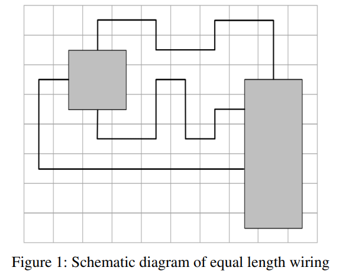

### B. Algorithm design(アルゴリズム設計)

等長配線は、レイアウト時に2つの段階で完了させることができる。まず第1段階では、各配線に対して最短経路を生成し、現在の配線ネットワーク内のすべての配線長から最大値と最小値を主制約として設定し、全体の配線長の合計を副制約として扱う。

第2段階では、アルゴリズムの収束速度を高めるため、第1段階終了時のフェロモンを現在のアリの初期フェロモン値として使用する。τminとτmaxを上下限として、両側のフェロモンを半分ずつ蒸発させ、アルゴリズムが早期に収束してしまい質の悪い解に落ち着くのを防ぐ。最終的な長さの目標値は、現在の配線ネットワークにおける各終端配線の長さを修正する基準値として設定され、アルゴリズムの収束時に更新されることで、現在の最長配線長を超えないようにする。

第2段階におけるフェロモンの更新では、現在の配線長が指定された長さに迅速に収束するように設計されており、各辺のフェロモンの増分は以下の式（式1）に従って計算される：

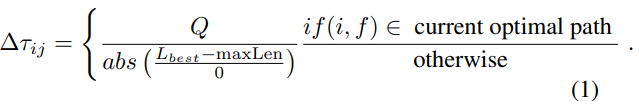

次の式の間違い？？
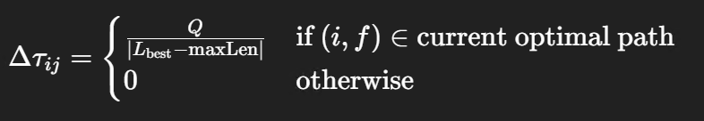

等長配線ネットワークは複数の二端配線ネットワークによって構成されているため、基本的な2端配線の考え方を借用できる。第1段階において、単一反復の終了条件は、現在の配線ネットワーク内のすべての2端輪郭線が配線完了した状態であり、複数回の反復後に最小の実行可能解を現在の最適解として選択する。第2段階では、等長基準より短い配線を中心に拡張を行う。

### C. . Presentation of experimental result(実験結果の提示)

等長配線においては、配線作業は2段階に分けて行われる。現在の等長配線ネットワークグループにおいてすべての2端配線が接続された段階で、一群の配線長が得られる。この中で最大の長さを基準値とし、他の配線長を補正して、すべての配線の最終的な長さが基本的に一致するようにする。

本実験では、この基準値を目標条件として、改良型アリコロニーアルゴリズムがこの種の問題に対して強い制約能力を持つことを検証するため、各反復ごとに配線長の値を記録し、配線長補正の収束グラフおよび最終的な配線効果図をプロットした。

図2は、第1グループの等長配線における補正収束図および配線効果図である。このネットワークグループでは、3本の等長配線を配置する必要がある。第1段階の配線後、各配線長の値はそれぞれ129、137、115であり、最大値137を基準値としてレイアウトを行った。

図3は、第2グループの等長配線における補正収束図および配線効果図である。このネットワークグループでは、5本の等長配線を配置する必要がある。第1段階のレイアウト完了後、各配線の長さは120、126、132、138、144であり、最大値144が等長配線の初期基準値として選択された。

図からわかるように、一度配線長の基準値が決まると、その値に達していない配線長は迅速に調整され、基準配線長へと収束する。これにより、配線ネットワークグループ内での配線長の一貫性が達成される。異なる目的関数の値を制約としてフェロモンを更新することで、最終的なアルゴリズムの収束結果に直接影響を与え、強い制約を持つアリコロニーアルゴリズムを構築できることが示された。

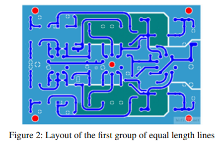

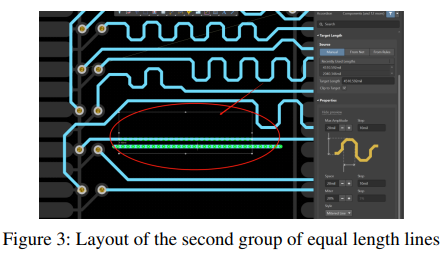

---
## III. Differential Pair Wiring(差動ペア配線)
### A.  Differential signal line(差動信号線)
差動信号線は、高速回路基板設計において非常に一般的である。例えば、USB、HDMI、Ethernetなどのデータ伝送では、差動ペア配線が用いられている。差動ペアは電磁干渉に対して優れた耐性を持ち、各ペアの信号線は同一の大きさで反対方向の信号を伝送する。信号線同士が近接しているため、チャンネル上のノイズは両方の信号に同時に影響を与える。

差動ペア配線を行う際には、2本の線の長さを一致させる必要がある。これにより、回路の性能と信号の完全性が向上する。通常、差動信号線の配線では、長さを一致させつつ、近接して配線する必要がある。図4は、差動信号伝送線の配線意図を示しており、差動信号線が常に等間隔を保ち、かつ配線長が近いことがわかる。

単一の信号線（シングルエンド信号線）は、信号線とグランド線の2本で信号を伝送するが、外部の影響によって電圧振幅が変化する可能性がある。信号が対向端に到達した際、送信時とは異なる信号-グランド間の電圧差が生じ、正しい信号を受信できなくなる。このため、単一伝送方式は干渉耐性に劣る。

図5に示すように、差動信号線における信号伝送の波形では、va = −vb である。図から分かる通り、任意の時点において、2本の信号線の電圧は同じ大きさで逆方向となっている。2つの伝送線間の電圧差は v = va − vb = 2va となる。仮に外部干渉が生じ、ある瞬間に信号線の電圧に振れ幅 t が発生しても、2本の線に同様に影響するため、v = (va + Δv) − (vb + Δv) = 2va となり、干渉前と同じ電圧差が保たれる。これは、差動信号線が適切なオフセットのもとでノイズ抑制効果を持つことを示している。

信号の完全性の観点から見ると、差動信号はクロストーク、同期スイッチングノイズ、電源ノイズ、グランドバウンスノイズの抑制に効果がある。

差動信号線の配線後には、2本の線の長さが一致しているかどうかを判断する必要がある。長さが一致していない場合、等長処理を行う必要があり、そうでなければ信号伝送に時間差が生じ、長い信号線の位相が遅れてしまう（図6参照）。2本の信号線の伝送タイミングが一致しなければ、電圧差が変化してしまい、受信側が正しい信号を取得できなくなる。

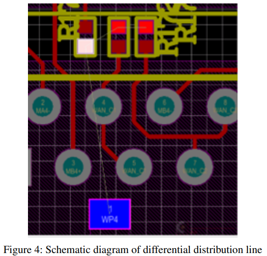

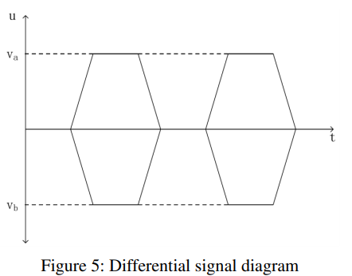

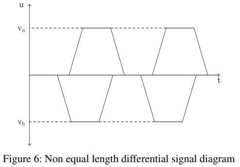

### B. Algorithm description and result presentation(アルゴリズムの説明と結果の提示)
差動ペアの配線をACOアルゴリズムで行う際には、2つのステップで実施できる。第1ステップでは等間隔のみを考慮し、2匹のアリが同時に移動する。第2ステップでは配線長の一致要求を満たすことを目的とする。

第1ステップにおいては、隣接ノード探索の方法を調整し、配線の次のステップを実行するたびに2匹のアリが同時に移動する。これにより、2本の信号線が厳密に等間隔となるように制約される。第2ステップでは、配線長が一致するように第1ステップで生成された配線を微調整する。

第1ステップで等距離配線を行う際、他の2端配線と同様の手順を用いるが、隣接点の探索方法が異なる。アリの現在の進行方向に基づいて次の到達可能な点を判定し、状態選択のための確率式を用いて進行方向を選ぶ。アリが終端点に到達した場合、または次の到達可能点が存在しない場合には探索を終了する。アルゴリズムでは複数回の反復を行い、各反復で各ペアのアリに対して一組の実行可能解を生成し、その中で最適経路の解のみを当該反復の結果とする。

2匹のアリの間隔が隣接経路探索の段階ですでに制約されているため、次の選択段階ではまず、2匹のアリの経路長の差が最小になることを主要な目標とする。経路長の差が同一である場合は、配線長や屈折点の数などの要件を個別に制約として考慮する。各反復後にはフェロモンの更新を行い、次の反復に備える。

アリが隣接点を探索する際は、直進か折り返しかの2つのケースがある。直進の場合は、現在の進行方向にある次の点が到達可能かどうかを判断し、可能であれば隣接点ベクトルに追加する。不可能であればその方向の隣接点を除外する。

折り返しが必要な場合は、状況に応じて判断する。図7では、アリが折り返し移動する8つのケースが示されており、それぞれ現在の方向と到達先の方向に基づいて、右下、右上、左下、左上などの方向がある。折り返しの際には、1匹のアリの現在位置を原点とし、もう1匹のアリが経路を探索する。まず、図中の円で示された位置が到達可能かどうかを判断し、到達可能であればその方向への折り返し移動を許可して隣接点ベクトルに追加し、不可能であればその方向への移動を取りやめる。

等距離配線が完了すると、各ペアの始点と終点間に1本ずつ配線が生成されるが、これらの長さが一致するとは限らない。そのため、差動ペア配線では線長を一致させるための「配線拡張処理」が必要となる。この処理では、主に短い方の配線を補正する。

配線を補正する過程では、配線経路に変動を加える必要があるため、もともとの等間隔制約が破られる可能性がある。このため、拡張された線が元の線からなるべく離れないようにすることが望ましい。この問題は、**経路オフセット（path offset）**という指標で評価できる。

経路オフセットは、拡張経路が元の経路からどれだけ逸れているかを測定するために使用され、拡張配線の軌跡が元の経路とできるだけ一致するように制御するために役立つ。図8では、Line1が元の配線、Line2が拡張された配線を示しており、t1とt2は拡張線が元の線から逸れた領域の大きさを表している。Line2のLine1に対する経路オフセットは、t = t₁² + t₂² で定義される。各オフセットブロックに対して2乗を用いるのは、大きなオフセットを抑制し、拡張配線が元の配線にできる限り近くなるようにするためである。

改良型ACOアルゴリズムを用いた第2ステップの配線では、配線長の差を第一の制約とし、経路オフセットを第二の制約とする。経路オフセットが小さいということは、拡張配線が他の信号線とほぼ等間隔であることを意味し、元の配線が完全な等間隔である場合には、拡張配線も高い精度で等間隔となる。したがって、差動ペア配線における等間隔性を維持したまま配線長を一致させる処理は、経路長とオフセット度合いを制御することで実現可能である。

次の実験では、2組の差動ペア配線を示す。1組は配線長の補正を必要とせず、もう1組は補正を必要とする。この実験により、アルゴリズム設計の妥当性を示す。

図9は、2組の差動信号線の配線結果を示している。図中の1つのグループは長さの一致処理を必要としないものであり、最初の配線ステップの終了時点で配線長と間隔が完全に一致している。もう1つのグループでは、完全に一致する線長のセットを得ることができないため、第2ステップで長さ一致処理が必要となる。図からは、アリが元の線の周囲で小さな変動を加えることにより、配線を延長する効果を得ている様子が見て取れる。

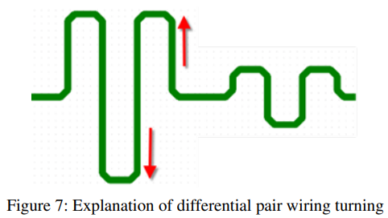

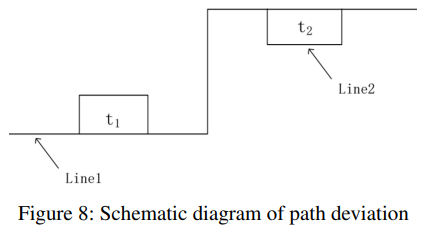

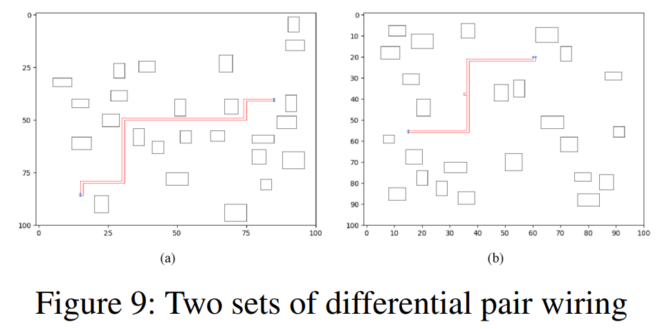

---
### IV. Conclusion(結論)
本論文では、改良型アリコロニーアルゴリズムに基づくPCB自動配線戦略を提案し、等長配線および差動ペア配線の要求に応じた最適化手法を設計し、実験によりその有効性を検証した。

等長配線および差動ペア配線の具体的なニーズを詳細に分析したうえで、これらの要求を満たしつつ、配線効率と品質をどのように向上させるかを検討した。以下に本研究の主要な結論をまとめる：

- 本論文で提案した改良型アリコロニーアルゴリズムは、多制約下におけるPCB配線問題の処理において優れた性能を示した。特に、フェロモンの蒸発と更新メカニズムの最適化を通じて、アルゴリズムの収束速度と大域的探索能力が向上し、局所最適解に陥る問題を効果的に回避した。

- 実験結果は、等長配線および差動ペア配線の両タスクにおいて、改良型ACOアルゴリズムが顕著な性能向上を達成したことを示している。

- 本研究で検討した配線戦略は、線長整合、干渉最小化、経路短縮といった複数の制約を同時に扱うことが可能である。最大長と最小長の値を設定し、それに基づいてACOで各配線を最適化することで、等長配線の要件を効果的に実現した。

- 差動ペア配線においては、2匹のアリによる同期歩行法により、信号線の等間隔性と線長一致を実現し、信号の完全性と干渉耐性の向上を図った。

- 複数のPCB設計例を用いた実験的検証を通じて、改良型ACOアルゴリズムは、等長配線および差動ペア配線の両方において、従来手法よりも高い配線成功率と品質を示し、実際の応用における有効性と実用性を十分に証明した。

将来の研究課題として、以下の点が挙げられる：

- アリコロニーアルゴリズムのパラメータ設定やフェロモン更新メカニズムをさらに最適化し、アルゴリズムの収束速度と解の質を向上させること。

- より大規模かつ複雑なPCB設計に適応できるよう、柔軟性の高い配線アルゴリズムの研究開発を進め、実際のエンジニアリング課題に対応すること。

- 消費電力、信号完全性、熱管理など、配線プロセスにおけるさらなる制約や最適化目標を導入し、より包括的な最適化アルゴリズムを開発すること。

- 本研究のACOを基盤としつつ、遺伝的アルゴリズム（GA）や粒子群最適化（PSO）など、他の知能的最適化アルゴリズムと組み合わせたハイブリッド最適化手法の応用可能性を探索し、配線の効率と品質をさらに向上させること。

---
## もう少し詳細な分析
