# A Multi-Objective Ant Colony Optimization for Routing in Printed CircuitBoards

## 要旨(Abstruct)
超大規模集積回路（VLSI）およびプリント基板（PCB）設計における自動配線は、エンジニアの作業を最適化するうえで重要である。これらは一般的なコンピュータ支援設計（CAD）ソフトウェアにより提供され、長年にわたる研究分野の一部である。電子機器が進化し、部品がより小型かつ高速になるにつれ、回路設計上の制約はより複雑化し、新たな課題が生じている。これらの困難に対処するため、計算知能アルゴリズムを用いた戦略が採用され、迅速な配線解の提供が図られている。こうした戦略の中でも、多エージェントおよび群知能アルゴリズムは特に有効であり、単独もしくは他手法と組み合わせて頻繁に応用されている。本論文では、配線間の長さ整合を強調したプリント基板用アリコロニー最適化（ACO）アルゴリズムの変種を提案する。本最適化関数は、トレースの長さ、他トレースとの交差回数、およびトレース間の長さ差という三つの目的を同時に最小化する。すなわち、アリたちは互いに交差することなく、他のトレースと同一長となる最短トレースを探索する。提案アルゴリズムは五つの基本的シナリオで評価され、それぞれについて複数回の実行結果に対して統計解析を行った。結果は、本アルゴリズムが長さ整合を含むPCB配線に対して有効な手法であることを示している。

キーワード：アリコロニー最適化；プリント基板；自動配線

---
## 1. Introduction
プリント基板（PCB）は電子部品の固定および接続のための基盤である。ほぼすべての電子機器に使用されており、PCBは一般に導電性と絶縁性の材料（通常は銅とガラス繊維またはフェノール樹脂）を交互に積層した構造を持つ。導電層には接続用のトレースおよび部品実装面がエッチングされ、平面上の配線に似た電子回路が形成される。より複雑な回路では、複数の導体層が用いられる。

導電層は最初は銅の全面で構成され、必要な接続以外の領域の銅を除去することで回路設計がエッチングされる。設計は基板上に印刷され、必要な接続部以外の銅領域を露出させ、腐食液に浸すことで不要な銅を溶解・除去し、設計されたトレースとプレーンを残す。

かつては回路設計を手作業で行っていたが、電気・電子工学の進歩により、部品とトレースの小型化が進み、電磁的許容誤差と制限がより重要になった。今日では、電子回路設計に特化したCADソフトウェアが不可欠であり、手作業では不可能な複雑なトレース設計を容易に行えるとともに、すべてのトレースに対する電磁的許容誤差を検証し、問題のある箇所をユーザーに警告する。複雑な回路においてこの検証を手動で行うことは、非常に困難あるいは不可能である。

Zhangらによれば、高周波回路では部品配置およびトレースの幾何学的特徴に起因する様々な課題がある。これらには、反射、干渉（クロストーク）、減衰、遅延、不安定性（ジッタ）、およびノイズが含まれる。これらの問題を緩和・回避するには、設計上の技術的手法が必要である。トレースは距離、厚み、最大・最小長、および層数に関する厳格な制限に従う必要がある。

特に高周波回路におけるデータおよびクロックトレースでは、信号の位相ずれや伝送遅延を防ぐために、等長化が重要である。信号が異なる距離を伝送すると到達時間にズレが生じ、信号の整合性が損なわれる。PCB上の空間的制約と部品の配置のため、これらのトレースは直線にはならず、最も長いトレースに合わせて他のトレースにカーブを付加することで長さを調整する。このとき、カーブの寸法は慎重に設計する必要がある。適切でない場合には、問題を悪化させる可能性がある。

現在、PCBトレースの自動配線を行うツールは存在するが、長さ整合のプロセスは依然として主に手動で行われており、設計者の個別判断と介入が必要である。

---
## 2. Related Works(関連研究)
自動配線の際、回路の電気的特性や複雑性に応じてさまざまなシナリオが発生する。主なシナリオには、部品間の接続、部品配置とPCBサイズの決定、クロック信号トレースの遅延最小化、干渉や電磁的問題の軽減を目的としたトレース長の整合などがある。これらのシナリオへの対応には、決定論的手法や計算知能技術、特に多エージェントアルゴリズムが用いられる。

Nathら［4］では、遺伝的アルゴリズムの特性を取り入れた離散粒子群最適化（DPSO-MU）を提案している。この手法では、突然変異ステップにおいてランダムに粒子を選び、前世代における最高フィットネスの粒子群に基づいて高フィットネス値の位置へ移動させる。これにより、標準的な離散PSOと比較して収束速度と安定性が向上する。

Berlier［5］では、並列遺伝的アルゴリズムを用いて部品配置と配線順序の最適化を行い、トレース長を最小化する。クラウドコンピューティング資源を利用し、64コアのマシン上で複数の遺伝的アルゴリズム集団を同時に実行する。この並列戦略により、逐次実行と比較して約50倍の高速化が実現され、実際の回路設計に対して有効であることが示された。

Badriyahら［6］では、遺伝的アルゴリズムを用いてPCB部品配置を決定し、PCBサイズの最小化、部品の重複防止、高発熱部品の分散配置を実現する。本アルゴリズムは計算時間とメモリ消費が大きいが、低複雑性の回路に対しては満足のいく結果を得ている。

Pandiarajら［7］は、差分進化アルゴリズムに基づく手法で、VLSI回路におけるトレース長の最小化を行っている。このアルゴリズムでは、回路層を分割・重ね合わせながら機能性を維持しつつ、トレース長と層数を評価関数に取り入れる。

Bhargab SinhaとBaishnab［8］は、アリコロニー最適化とリバーフォーメーションダイナミクス（RFD）を組み合わせたハイブリッドモデルを提案しており、VLSI配線の課題に対処している。RFDは、河川の形成過程に着想を得た計算アルゴリズムであり、水が地形を浸食しながら最小抵抗の経路を形成する自然現象を模倣する。このモデルは他の手法よりも高性能を示すが、より多くのメモリと処理能力を必要とする。

トレース配線とその形状に関する群知能およびエージェントベース手法による関連研究は、通常はトレースの1つの特性のみを最適化するか、あるいは各特性に対して段階的に処理を行っている。それに対して本研究では、複数の特性を同時に最適化する。また、ACOアルゴリズムは配線問題で頻繁に用いられているが、PCBのトレース配線においてはあまり活用されていない。

---
## 3. Ant Colony Optimization（アリコロニー最適化）

アリコロニー最適化（Ant Colony Optimization、ACO）は、アリの採餌行動に着想を得た群知能アルゴリズムであり、集団ベースの探索を目的とする。アリたちはヒューリスティック関数とフェロモン経路に導かれて探索空間を移動し、解の質に応じてフェロモンを蓄積していく。各反復で、アリは解を逐次構築しながら道筋にフェロモンを残し、良い解を強化していく。アリたちはフェロモン濃度と最良既知解の影響を受けながら、高フェロモン領域を優先的に探索する。

このアルゴリズムは当初、巡回セールスマン問題（TSP）に対して試験された。TSPはNP困難な組合せ最適化問題であり、すべての都市を一度ずつ訪れて出発地に戻る最短経路を求めるものである。都市数が n の場合、考えられる経路は n! 通り存在し、総移動距離を最小化することが目標となる。位置 i にいるアリ k が位置 j に移動する確率は次式で定義される：

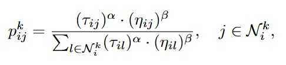

ここで、
- $\tau_{ij}$：エッジ (i, j) におけるフェロモンレベル
- $\eta_{ij}$：ヒューリスティックな魅力度（TSPでは距離の逆数）
- $\alpha, \beta$：それぞれフェロモンとヒューリスティック情報の影響度を制御する定数
- $\mathcal{N}_{i}^{k}$：アリ k が位置 i にいるときの隣接可能な選択肢の集合

フェロモン経路の更新式は次の通りである：

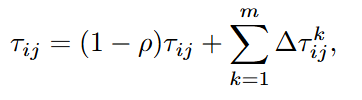

ここで、
- $\rho$：フェロモンの蒸発率
- $m$：アリの総数
- $\Delta\tau_{ij}^{k}$：アリ k がエッジ (i, j) に与えるフェロモン量。これはそのアリの構築した解の質（たとえばTSPでは経路長の逆数）に依存する。

この章では、ACOの基本原理を紹介しており、次章ではこのACOをどのようにPCB配線に応用したかが述べられる。

---
## 4. PCB Trace Router with ACO（ACOを用いたPCBトレースルータ）
本ACO PCBトレースルータは、以下の三つの目的を同時に最適化する：
- トレースの長さ
- 他トレースとの交差回数
- トレース間の長さ整合

最適化関数$f_{opt}$は、これら三つの目的の加重平均によって算出される。ACOにおいては、1つのトレースごとに1つのコロニーが割り当てられる。コロニー 
$c$に属するアリ$k$に対する目的関数は以下のように定義される：

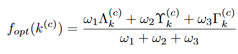

ここで、
- $\Lambda_{k}^{(c)}$：トレースの長さ
- $\Upsilon_{k}^{(c)}$：このトレースが他のトレースと交差する回数
- $\Gamma_{k}^{(c)}$：このトレースと他のトレースとの長さの差の総和
- $\omega_{1}, \omega_{2}, \omega_{3}$：それぞれの目的の重み係数

ルータの探索空間は、長方形のPCBの銅面を表す。このPCB領域は等サイズの正方形セルに分割される。PCBの寸法は行数と列数で指定され、行数が$m$、列数が$n$、合計$m \times n$セルとなる。行は下から上へ、列は左から右へ番号が付けられる。各セルにはACOのアリが訪れることが可能であり、位置番号は左下のセルを1として、2番目の行の1列目が$n+1$となるように順に付けられる。任意の位置$i$は$(m_i, n_i)$の座標を持つ。

ACOのアリたちはセルを探索しながらフェロモンを蓄積し、最適なトレース経路を見つけようとする。回路は複数のトレースで構成され、各トレースは異なる部品間を接続する。したがって、ACOルータではトレース数$C$に等しい数のコロニーが用いられる。各コロニーは同数のアリ$K$を持ち、全体では$C \times K$匹のアリが存在する。各トレースにはあらかじめ始点と終点の位置が決められている。

図2は、6行17列のPCBセル上に3本のトレースを持つ探索空間を表している。黒点はどのコロニーのアリでも訪問可能なセル、緑点はトレースの始点、赤点は終点を表している。コロニーは緑点に初期化され、各アリは赤点を目指して最適経路を探索する。

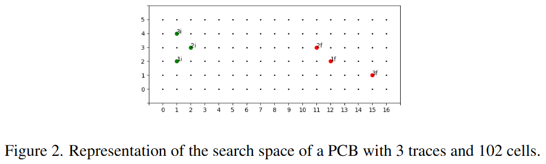

コロニー$c$に属するアリ$k$の経路は$\lambda_{k}^{c}$と記述され、その長さは$\Lambda_{k}^{c}$である。この経路は、始点から終点までにアリが選択したセルの列である。位置$i$にいるコロニー$c$のアリ$k$は、他コロニーの始点や終点でない限り、隣接セルに移動できる。位置$i$の近傍$\mathcal{N}_{i}$は右・左・上・下の4セルからなる。位置$i$にいるコロニー$c$のアリ$k$が位置$j$に移動する確率は次式で与えられる：

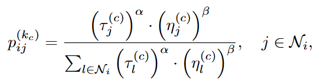

ここで、
- $\tau_{j}^{(c)}$：コロニー$c$の位置$j$におけるフェロモン量
- $\eta_{j}^{(c)}$：位置$j$に対するコロニー$c$のヒューリスティック情報
- $\alpha, \beta$：フェロモンとヒューリスティックの影響度を決定する定数
- $\mathcal{N}_{i}$：位置$i$の近傍

ヒューリスティック情報は、位置の魅力度を表す。通常のACOでは、これは距離の逆数で定義されるが、本ルータでは探索空間が等サイズのセルに区切られており、隣接セル間の距離はすべて等しいため、この定義では意味を成さない。そこで本研究では、他コロニーのフェロモン量の逆数を用いてヒューリスティック情報を定義する。これは、他のコロニーによってあまり使用されていない位置へとアリを引き寄せ、交差の少ない経路の形成を促進する。このときのヒューリスティック情報は以下で計算される：

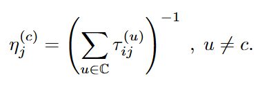

フェロモン更新式は先に示した式 (2) に従い、アリ$k$によって位置$j$に追加されるフェロモン量は次式で与えられる：

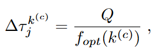

ここで、
- $Q$：フェロモンの量を調整する定数
- $f_{opt}(k^{(c)})$：先に定義した目的関数。これにより、トレース長、交差数、長さ整合の三要素が評価される。分母に置かれるのは、いずれも最小化が目的だからである。

$\Lambda_{k}^{(c)}$は経路のステップ数を示す。パラメータ$\Upsilon_{k}^{(c)}$は、アリ$k$の経路が他コロニーの最良経路と重複する回数を数える。これは以下で計算される：

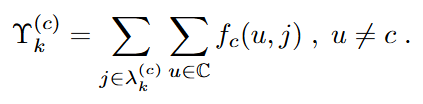

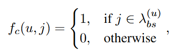

ここで、$\lambda_{bs}^{(u)}$はコロニー$u$によってこれまでに見つけられた最良の経路を示す。
最後に、$\Gamma_{k}^{(c)}$は他のコロニーの最良経路との長さ差の二乗和であり、以下のように表される：

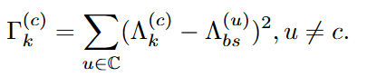

図3はACO PCBトレースルータの簡易フローチャートを示している。図3(a)はアルゴリズムのメインループ、図3(b)は各コロニーの移動処理を表している。すべてのコロニーが移動を終えた後、フェロモンの更新が行われる。アルゴリズムは終了条件が満たされるまで反復を続ける。終了条件には、あらかじめ定めた反復数に達することのほか、「交差なし・長さ整合済みの結果」が得られた時点での早期停止戦略も導入されている。最短経路の達成までは考慮しないが、複雑なトレース数が多い問題に対して実行可能な解を得るためにはこの条件で十分であると本研究では見なしている。

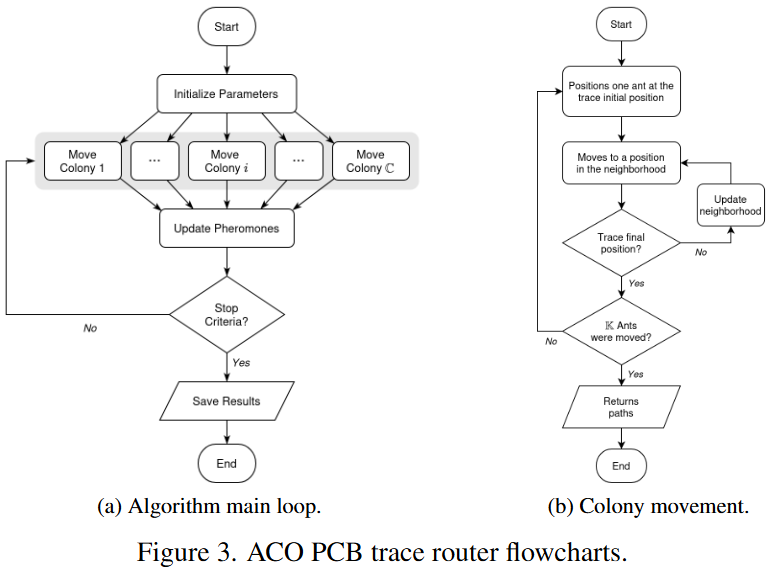

---
## 5. Experimental Results（実験結果）
提案したアルゴリズムはC++で実装され、グラフ生成および結果分析のための補助スクリプトはPythonで記述された。開発された手法は5つのシナリオにおいて試験され、すべてのシナリオで最適解の特性が既知である。結果は以下の基準に基づいて評価される：交差なし、すべてのトレースが同じ長さ、かつこの長さが可能な限り最短であるとき、その結果は「最適」とみなされる。この定義のもと、各シナリオには複数の最適解が存在する。図4は、5つのシナリオそれぞれに対して手動で発見された最適解を示している。

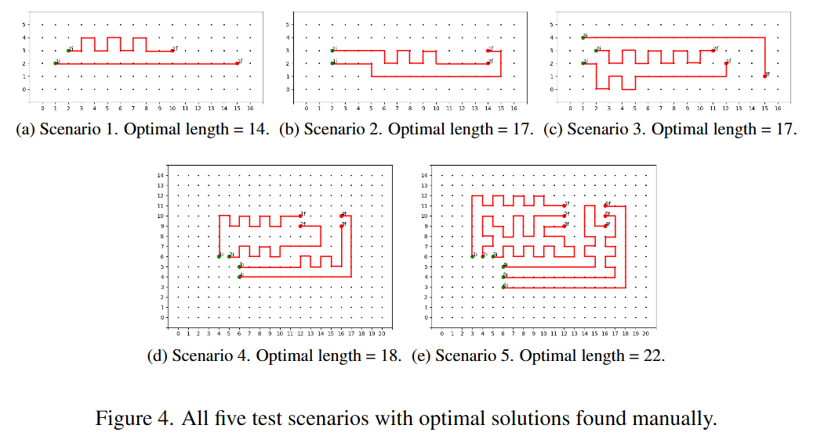

すべてのシナリオにおいて、提案アルゴリズムは交差なしかつ長さ整合済みの配線を達成できた。これらの2条件を満たす結果は、「実行可能（viable）」な解とみなされる。最初のシナリオ（図4a）は最も単純である。これは2本のトレースから成り、両方とも同じ行内に始点と終点を持つ。第2シナリオ（図4b）はやや複雑であり、2本のトレースの始点と終点が同じ列にあるが、終点が異なる行に位置している。1本のトレースは他方を回避しながら、始点と終点の間の空間を使って配線を完了する必要がある。

第3シナリオ（図4c）は、先の2シナリオを組み合わせた構成である。2本のトレースは第1シナリオと同様に整列しており、3本目のトレースは始点と終点が不揃いである。このトレースは他の2本を回避するように経路を選ばねばならない。第4シナリオ（図4d）は4本のトレースを持ち、Square Quad Flat Package（QFP）とDual In-Line Package（DIP）のIC間の配線を簡略化したものである。第5シナリオ（図4e）は第4シナリオと同じ構造だが、トレース数が6本に増えている。

表1には、各シナリオについてプログラムを1,000回実行した平均結果を示す。1行目は最適解が発見された割合を示す。2行目は、少なくとも「交差なし」および「長さ整合済み」の2つの目的を満たした結果の割合である。これらは3目的中で最も重要なものとされるため、「実行可能」な結果として評価される。3行目は、停止条件に到達するまでの平均反復回数である。4行目は、停止条件までに要した平均実行時間（秒）とその標準偏差を示す。最後の5行目は、出力されたトレースの平均長とその標準偏差である。各シナリオにおいて定義された最小長に近いほど良好である。実行は、「実行可能な解」が見つかった時点で停止した。計算機の構成は、Intel i9-12900KF CPU、メモリ128 GBであった。

ハイパーパラメータについては、αとβの両方を2とし、フェロモンとヒューリスティックに等しい影響を持たせた。フェロモンの付加定数 $Q$は1に設定され、蒸発率 
$ρ$は0.5とした。つまり、フェロモンは各反復ごとに半減する。これらの値はACOアルゴリズムにおいて一般的である。各コロニーのアリ数$K$は100に設定した。この値は初期探索の幅と実行時間とのバランスから選ばれた。値を小さくすると局所解に陥る率が高くなり、非実行可能解や準最適解が増加した。値を大きくすると、実行時間が著しく延びる傾向があった。ただし、この値にはある程度の柔軟性がある。最後に、三目的（トレース長、交差、長さ整合）を評価する重み係数$\omega_{1}, \omega_{3}, \omega_{3}$は、それぞれ 10、45、45 に設定した。これはトレース長の最小化が他の目的を支配しがちであったため、その影響を抑えるためである。他の2目的には等しい重みを与えた。

図5は各シナリオにおける5つの結果を示しており、(a)〜(q) は最適解とみなされるが、提示されたすべての結果は「実行可能な解」である。

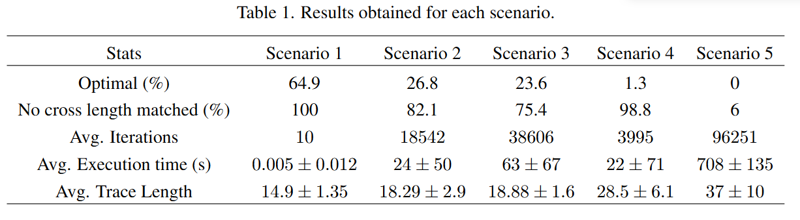

---
## 6. Conclusions
本論文では、プリント基板（PCB）のトレース配線における交差の最小化と長さ整合の確保を目的とした、ACOアルゴリズムの変種を提案した。アルゴリズムは、シナリオ1において最も良好な性能を示し、64.9％の最適解と100％の実行可能解を最小反復数と短い実行時間で達成した。しかし、問題の複雑度が上がるにつれて性能は低下した。シナリオ5では最適解は1つも得られず、実行可能解も6％にとどまり、さらに多くの反復と長時間の実行が必要であった。

シナリオ2および3では、最適解の達成率はおよそ25％であり、実行可能解は75％以上であった。より複雑なケースにおける性能の低下にもかかわらず、提案アルゴリズムは、最初の4シナリオにおける多数の試行において、長さ整合かつ交差のないトレース配線を実現できることを示し、PCB配線における有効な手法である可能性を示した。

一方で、最適解の発見数が少なかったことや、シナリオ5での性能不良、複雑な問題における実行時間の長さは、本手法を実用的な応用へ展開するにあたって、ハイパーパラメータのさらなる調整やアルゴリズムの改良が必要であることを示している。

将来的な改良案としては、すべてのシナリオにおけるハイパーパラメータの最適化、各目的の評価における新たなヒューリスティックの導入、より多様なシナリオでの試験、およびアリによる斜め方向への移動の許可などが挙げられる。