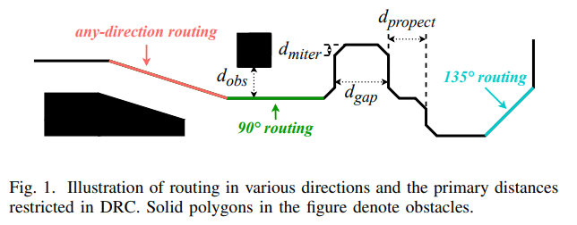
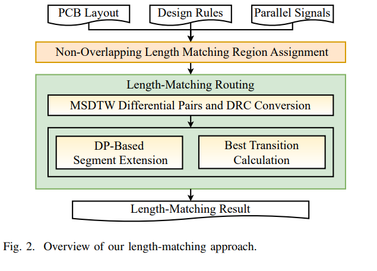
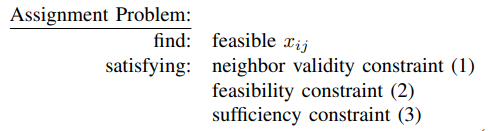

# Obstacle-Aware Length-Matching Routing for Any-Direction Traces in Printed Circuit Board

## 要旨(Abstruct)
プリント基板（PCB）配線における新たな応用は、自動等長化に対して新たな課題をもたらしており、特に任意方向の配線における対話性を保った元の配線保持の適応性が求められている。これらの課題は、各トレースに対して非重複な配線領域を割り当てる段階と、それらの領域内で目標長さに到達するまでトレースを蛇行させる段階という、2つの直交する段階で対処可能である。本論文では、主に蛇行させる段階に着目し、利用可能な空間の活用を最適化しつつ、元の配線形状を保持したまま等長化を実現する障害物対応の詳細配線手法を提案する。さらに、提案するMulti-Scale Dynamic Time Warping（MSDTW）法を取り入れることで、従来の非結合問題に対する差動ペアの処理も可能となる。実験結果は、本手法が複雑な制約下においても有効な等長配線能力を有し、従来手法と比較して好成績を示すことを実証している。

---
## I. Introduction
いくつかのプリント基板（PCB）設計プロトコルでは、同一グループ内の並列信号が同時に目的地へ到達することが要求される。これらの信号の到達タイミングが一致しない場合、設計の安定性や機能性を損なう深刻なクロックスキューが生じる可能性があり、そのために等長化技術が導入され、信号の伝播遅延の差を最小化することによってトレース長を一致させることが求められる。

現在の多くの等長化ツールは、障害物の多い領域での詳細配線処理において、依然として手動による調整を必要とする。一方で、高速設計における等長化アプローチは、90度や135度といった従来の方向に限定されない、任意方向への配線に適応する必要がある。このことは図1に示されている。

---
## A. Related Works（関連研究）
近年、等長化に関する研究が数多く行われており、それぞれ異なる課題に対して有効性が確認されている。

障害物認識の観点では、多くの既存手法がグリッドベース戦略を用い、まず障害物と交差しない安全なトラックを固定し、それからその上にトレースの詳細配線を決定する。たとえば、Kohiraらは、双連結成分に基づくグリッドアプローチを採用して障害物を含む空間における蛇行の上限を評価し、その上限に近づけるための配線アルゴリズムを提案した [4]。さらに彼らは、ほとんどのケースで小さな等長誤差を達成可能なヒューリスティック手法であるConnectivity Aware Frontier Exploration（CAFE）ルーターを提案した [5]。Yanら [6] は、グリッド空間における障害物認識型の領域分割法を用い、最短経路生成器を利用して等長化を行った。Hsuら [16] および Chenら [17] は、障害物環境下でのバスルーターに対してクラスタリング、接続、リップアップおよび再配線に関する複数の手法を提示した。Chengら [18] は、障害物回避型のバス等長化手法において、配線可能性とトレース長を同時に最適化した。Yanら [3] は、使用するグリッド空間を最小限に抑えつつ、等長化制約を満たす単層障害物認識型バスルーターを提案した。

等長化目標の決定においては、Kuboら [1] が過大な目標長の設定を防ぐために、対称スラントグリッドインターコネクト方式を用いた。Nakataniら [11] は、最大トレース長を抑えつつ全体のトレース長を最小限に保つため、最小コスト最大フローアルゴリズムを活用して元トレースを最適化する方法を提示した。Ozdalら [2][7] は、元の配線段階において後続の等長化処理を支援するリソース分配スキームを導入し、さらにラグランジュ緩和を取り入れて、異なる優先度を持つトレースへのグリッドセルの割り当てと目標長の最小化を図った。

Kitoら [14] は、蛇行中のトレース長増加を抑えるためにシミュレーテッドアニーリングを導入した。Zhangら [10] は、仮想境界を用いてピンを固定し、配線空間を分割・個別処理することで、全体のトレース長を削減しつつ、以前の手法 [23] と比較してトレースの配線類似性を高めた。

Yanら [8] は、Bounded-Sliceline Grid（BSG） [24] を用いて等長化を2次計画問題に変換し、その後パターン生成規則を適用して最終的な蛇行を実現した。Tsengら [13] は、クロストークの影響を低減するため、パターン間のギャップをできるだけ大きく取る整数線形計画（ILP）により等長化問題を解決した。Zhangら [12][25] は、無秩序なピンペア間の最長共通部分列に基づく単一商品フローアルゴリズムを採用して元配線を解決し、R-flipおよびC-flip [4] によってトレース長を調整した。Satoら [15] は、ピンペアの選択と接続により等長化効率を高めるためのセットペア配線用パターン生成器を提案した。Leeら [9][26][27] は、成熟した同時エスケープ配線アルゴリズムと、差動ペアの等長化を最小コスト中央値点ベースで組み合わせた手法を研究した。

---
## B. Motivations（動機）
現在の多くの自動等長化手法は、元のトレース配線を上書きしてしまう可能性があるか、トレースが最大で8方向に配線されるという前提に立っている。しかし、近年の高速PCBでは、トレースが任意の方向に配線されることが一般的となっており、このような任意方向のトレース設計が指定されることも多い。主要な商用ツールである Allegro PCB Designer [22] においても、このようなトレースを生成するためのルートオフセット機能が実装されている。

実際のアプリケーションでは、これらのトレースの元の配線が等長化後も保持されることが望まれている。なぜなら、ユーザーは、自身の認識や操作性を混乱させたり、コンピュータ支援設計（CAD）プロセス中に慎重に設計した配線が破壊されたりする結果を好まないためである。さらに、トレースは通常、異なる設計ルール領域（DRA）を通過することが多く、等長化手法は複数の設計ルールチェック（DRC）を考慮しなければならない。

これらのギャップが、等長化技術が産業レベルの標準に対応することを求める動機となっている。

---
## C. Contributions（貢献）
等長化プロセスは、元のトレースに対して非重複な領域を割り当てる段階と、それぞれのトレースをその領域内で蛇行させる段階という、2つの直交する段階に分けることができる。本論文では、主に後者の段階に焦点を当て、元の配線特性をできる限り保持しながら自動的に等長化を実現することを目的とする。

また、等長化の応用においては差動ペアが頻繁に含まれる。差動ペアは、等長化の際に単一の広い単端トレースとして扱われるのが一般的であるが、この方式では実用上多くの困難がある。特に、差動ペアが厳密に結合されていない場合に問題が生じやすい。

本論文では、これらの問題を解決するために Multi-Scale Dynamic Time Warping（MSDTW）法を提案する。図2に本手法のアルゴリズムフローを示す。

本論文の貢献は以下の通りである：
- 本論文は、任意方向配線を対象とした最初の等長化研究であり、障害物対応ルーティングおよび複数のDRCに対応していると考えられる。
- 提案された等長化手法は、貪欲法、動的計画法（DP）、計算幾何を組み合わせたものである。既存の手法と比較して、固定トラックや空間の規則性に依存した事前定義されたモードに従うことなく、より柔軟なルーティングを実現し、任意方向のトレースに対する等長化を、元の配線形状を保持した状態で達成する。
- 差動ペア間の等長化を支援するために MSDTW 法を提案した。この方法は、厳密な結合がなされていない場合でも差動ペアを中央値トレースへと変換し、その後、中央値トレースを差動ペアへと復元することが可能である。MSDTWの応用は、提案する等長化手法に限定されず、より広範な利用が可能である。

---
## 2. Problem Formulation（問題定式化）
等長化は、遅延調整（delay tuning）とも呼ばれ、通常はすでに配線されたPCB上のトレースに対して適用される。トレースの長さは、信号の伝播遅延を意味する。伝播遅延がタイミングエンジンで考慮される唯一の要因ではないが、等長化の議論においては他の遅延要因は一般に無視される。

本手法では、各トレースを独立に蛇行させるため、個別の目標長さに対応可能である。厳密には、他の遅延の影響も、各トレースの目標長（すなわち、実際に必要とされる伝播遅延に対応した長さ）を調整することにより考慮可能である。

本論文では、現代の高速PCBにおける産業ニーズを満たすため、任意方向トレースの等長化ルーティングに注力する。図1に示された等長化に関する設計ルールチェック（DRC）における主要な距離制約は、以下の通りである：

- $d_{gap}$：トレース間の距離を制限し、自己誘導やクロストークなどを防止する。
- $d_{obs}$：トレースと障害物間の距離を制限する。
- $d_{protect}$：極端に短いトレースセグメントが発生しないように最小長を制限する。
- $d_{miter}$：凸パターンのためにコーナーを丸める設定。直角や鋭角の回転は、実際には鈍角に丸められる。

本論文で使用されるいくつかの重要な概念は以下の通りである：

- __Trace__：PCBレイアウトにおける信号トレースで、複数の接続セグメントで構成される。ネットまたはワイヤとも呼ばれる。
- __Any-direction__：任意方向ということ。90度または135度に限らず、任意の方向に配線されたトレースを指す。
- __Target length__ $l_{target}$：目標長。あるマッチンググループ内で各トレースが一致すべき長さ。元のトレース長以上でなければならない。
- __Routable area__：ルーティング可能領域。各トレースに割り当てられた非重複の配線領域の総体。不規則なポリゴンとして表現される。
- __Obstacle__：障害物。トレースが通過できないポリゴンであり、本論文ではルーティング可能領域の一部として扱う。

したがって、本論文で扱う問題は次のように定式化される：

__Any-direction length-matching problem__ (任意方向等長化問題) 
PCBレイアウト、設計ルール、およびマッチンググループが与えられたとき、各マッチンググループに対して、与えられた目標長さ ltarget に合わせて、そのグループ内の各トレースを自身に割り当てられたルーティング可能領域内で延長し、元の配線形状をできる限り保持するようにする。

説明の簡潔さを保つため、本論文では幾何計算の煩雑さを省略し、コーナーが直角で構成される凸形状パターンを前提として議論を行う。

---
## 3. Region Assignment（領域割り当て）
[8] により明らかにされた、長さと空間の関係に基づき、各トレースに対して等長化ルーティングが可能な十分な領域を割り当てることが必要である。同様の問題は、たとえば [8] では二次計画法を用いて、[7] ではラグランジュ緩和法を用いて議論されている。

本手法では、レイアウトに従って設計を分割し、いくつかの領域を構成し、以下の制約を考慮して処理を行う：

1. __隣接妥当性（Neighbor Validity）__ 
ある領域は、自身に隣接するトレースにしか割り当てることができない。

ここで、$x_{ij}$は領域$i$がトレース$j$に割り当てる面積を表す。

2. __実行可能性（Feasibility）__ 
領域の割り当て面積は正であり、領域の容量を超えてはならない。

3. __充足性（Sufficiency）__ 
各トレースは、隣接する領域から必要な面積を受け取らなければならない。

これらの制約に基づき、以下の線形計画（LP）問題を構築して解く：

__割り当て問題（Assignment Problem）__ 
以下を求めよ：
- 実行可能な${x_{ij}}$

以下の制約を満たすこと：
- 隣接妥当性（式1）
- 実行可能性（式2）
- 充足性（式3）

この割り当てスキームは、後続の段階において元の配線を保持するために、ルーティング可能領域内にそれを確保することを保証する。

既存の研究 [21] におけるいくつかの手法は、LPが実行不可能である場合により良いルーティングを見つけ出すために利用できるが、本論文ではそれらについて詳細には触れない。

---
## 4. DP-Based Segment Extension（動的計画法に基づくセグメント延長）
トレースの長さ$l_{trace}$を目標長$l_{target}$に到達させるために、本ルーティング手法では、セグメントに対して直交方向に凸パターンを挿入する。この処理は「セグメントの延長（extension）」と呼ばれる。拡張は計算幾何学に基づいており、任意方向のルーティングに適合する。

各セグメントは可能な限り延長され、延長後のセグメントは、必要に応じてさらに延長できるように、複数の新しい構成セグメントに置き換えられる。この延長処理は、$l_{trace}$が$l_{target}$の許容誤差内に収まるまで繰り返され、「アコーディオン」や「トロンボーン」に類似したパターンが生成される。全体の DP ベースの延長手順はアルゴリズム1に示されている。

---
## A. State Transition（状態遷移）
(T.B.D.)
